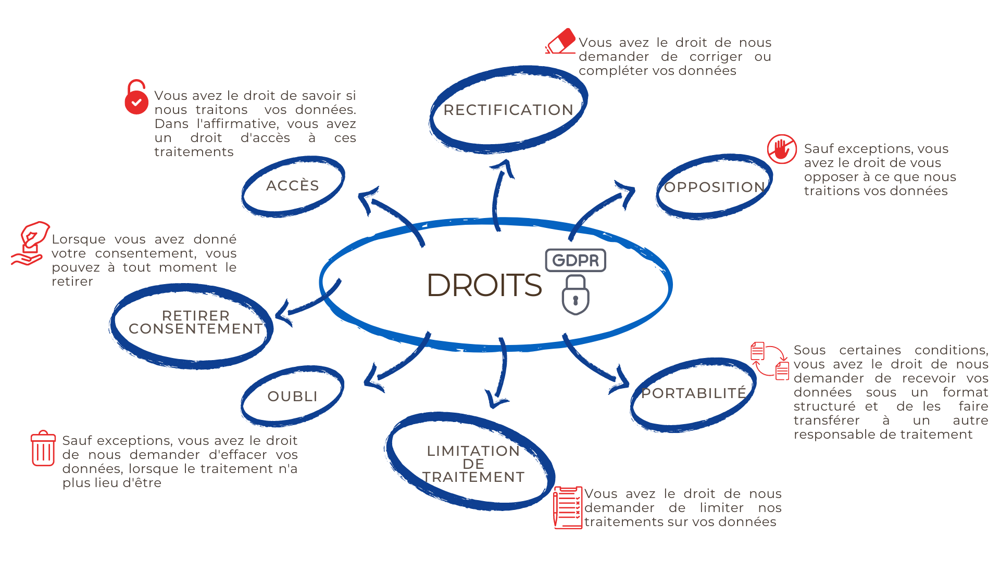
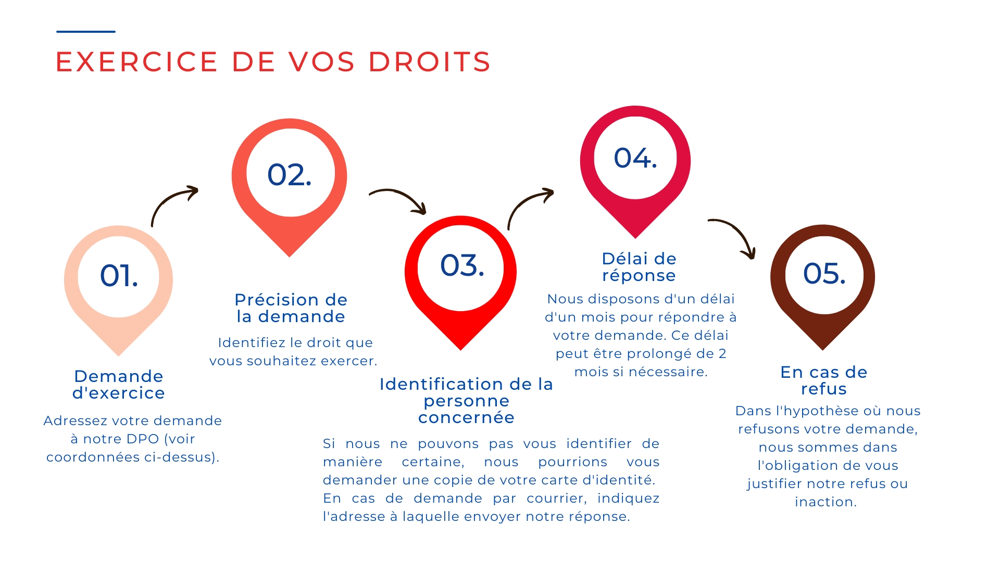

# RGPD - AUREA IMMOBILIER

- **URL** : https://www.aurea-immobilier.fr/catalog/gdpr.php
- **Recupere le** : 2026-09-18T09:00:37
- **Description** : AUREA IMMOBILIER
- **Mots** : 1993 | **Images** : 5 | **Liens internes** : 41

---

## Structure des titres

- H1 : RGPD
    - H3 : L'Agence
    - H3 : Nos services
    - H3 : Liens utiles
    - H3 : Nos annonces
      - H4 : Nous respectons votre vie privée.

## Contenu

POLITIQUE DE PROTECTION DES DONNÉES
Dernière mise à jour : Février 2023
POURQUOI AVOIR ADOPTÉ UNE POLITIQUE DE PROTECTION DES DONNÉES ?
La société AUREA IMMOBILIER (ou « la société ») accorde une grande
importance à la protection de vos données et met tout en œuvre pour les protéger.
AUREA IMMOBILIER agit en toute transparence et en conformité avec la réglementation applicable, en
particulier le
Règlement (UE) 2016/679 du Parlement
européen et du Conseil du 27 avril 2016 relatif à la protection des personnes physiques à
l'égard du traitement des données à caractère personnel
(ci-après «
RGPD ») et à la
Loi
n°78-17 du 6 janvier 1978 relative à l'informatique, aux fichiers et aux libertés
.
La présente Politique Vie Privée (ci-après également « la Présente »)
s'applique aux traitements de données à caractère personnel effectués par la
société. Dans le cadre de sa relation client. Elle n'est en rien responsable de la collecte et du
traitement des données faites par le client auprès de ses clients finaux.
La société dans le cas des solutions « logiciel Cloud » ( ou « SAAS ») est
sous-traitante au sens RGPD du client et se doit d'appliquer les mesures nécessaires à maintenir la
sécurité, la confidentialité, l'intégrité et la disponibilité des
données que le client lui confie par le « logiciel Cloud».
Nous nous gardons la possibilité de modifier la présente Politique à tout moment, notamment
pour tenir compte des éventuelles évolutions réglementaires, législatives,
jurisprudentielles ou de nos services. Dans la mesure du possible, nous vous informerons par tout moyen des
modifications substantielles apportées à la Présente. Nous vous encourageons à
consulter régulièrement la Présente afin de vous tenir à jour sur la manière
dont nous traitons vos données.
QUI EST CONCERNÉ PAR LE TRAITEMENT DES DONNÉES À CARACTÈRE PERSONNEL ?
Les personnes concernées (ci-après également désigné par l'appellation «
vous ») par les traitements effectués par la société sont toutes les personnes dont les
données à caractère personnel sont traitées dans le cadre de la contractualisation de
la solution logicielle.
Les données personnelles des « clients finaux » peuvent faire l'objet de traitement automatique
comme l'envoi de mail mais uniquement après gestion du consentement par le client.
La consultation des données personnelles des clients finaux ne se fait qu'avec l'accord du client et
uniquement à des fins de maintenance et par du personnel dument habilité.
INFORMATIONS SUR NOS TRAITEMENTS DE VOS DONNÉES
QUI EST LE RESPONSABLE DE TRAITEMENT ?
Le responsable du traitement est AUREA IMMOBILIER, société de droit français, au capital social
de
1000 euros, immatriculée au Registre de Commerce et des Sociétés sous le
numéro 931635924, numéro TVA FR30931635924 et dont le siège social est basé à
2 ROUTE DE LA GRAND MARE 95420 MAUDETOUR-EN-VEXIN (article 4.7 RGPD).
DÉSIGNATION D'UN DÉLÉGUÉ EXTERNE À LA PROTECTION DES DONNÉES
(CI-APRÈS « DPO »)
Le DPO de AUREA IMMOBILIER est M Hélène VERMEIRE BENZ, ce dernier peut être
contacté par mail à
l'adresse helene.vermeire@aurea-immobilier.fr.
QUELLES CATÉGORIES DE DONNÉES TRAITONS-NOUS ET POURQUOI ?
Nous vous détaillons ci-dessous les données personnelles que nous traitons en fonction des
finalités que nous poursuivons ainsi que leur mode de collecte. Nous ne traitons les données
suivantes que lorsqu'elles sont pertinentes et strictement nécessaires au traitement.
Opérations liées à la gestion de nos relations avec nos prospects
Bases légales
Art. 6.1.b) : Exécution de mesures précontractuelles
Art. 6.1.f) : Intérêt légitime de la société
Finalités
Fourniture, sur demande, de démonstrations d'outils et de solutions à nos prospects.
Gestion de la relation avec les prospects manifestant un intérêt pour les outils et
solutions.
Fourniture de conseils, renseignements ou réponse aux questions de tout ordre adressées
par les prospects.
Cette finalité se base sur l'intérêt légitime de la société de traiter
les données personnelles des prospects s'adressant à elle afin d'être en mesure de
répondre à leurs demandes/questions.
Source et catégories de données traitées
Auprès de vous, via nos formulaires, par téléphone ou par
e-mail :
Données d'identification personnelle (nom, prénom, numéro de
téléphone, adresse e-mail);
Données professionnelles (agence, société et adresse professionnelle);
Toute autre information que vous nous auriez communiquée.
Opérations liées à la gestion de nos relations avec nos clients
Bases légales
Art. 6.1.b) : exécution du contrat
Finalités
Service client sur demande par téléphone, e-mail et tout autre moyen
de communication suite à votre sollicitation.
Source et catégories de données traitées
Auprès de vous, via nos formulaires, par téléphone ou par
e-mail :
Données d'identification personnelle (nom, prénom, numéro de
téléphone, adresse e-mail);
Données professionnelles (agence, société et adresse professionnelle);
Toute autre information que vous nous auriez communiquée.
Opérations liées à la gestion de nos relations avec nos partenaires
(potentiels)
Bases légales
Art. 6.1.b) : exécution de mesures précontractuelles ou contractuelles
Finalités
Gestion des procédures de sélection de nos partenaires potentiels.
Gestion de nos conventions avec nos partenaires.
Réalisation de projets communs.
Source et catégories de données traitées
Auprès de vous, par e-mail :
Données d'identification personnelle (e-mail);
Données professionnelles (agence);
Toute autre information que vous nous auriez communiquée.
Gestion de la messagerie générale
Bases légales
Art. 6.1.f) : Intérêt légitime
Finalités
Gestion des messages reçus.
La société a un intérêt légitime à traiter les données des
personnes qui prennent contact avec elle afin d'être en mesure d'y répondre adéquatement.
Source et catégories de données traitées
Auprès de vous :
Données d'identification personnelle (nom, prénom, e-mail);
Toute autre donnée que vous nous auriez communiquée.
Autres opérations liées à la fréquentation du logiciel
Bases légales
Art. 6.1.a) : consentement
Art. 6.1.f) : Intérêt légitime de la société
Finalités
Amélioration de nos services par l'analyse de l'utilisation du site. Cette analyse nous permet
d'améliorer l'intérêt et l'ergonomie de nos services.
Assurer la sécurité et le bon fonctionnement du site
La société a un intérêt légitime à garantir la sécurité
de l'information et le bon fonctionnement de sa solution logicielle.
Source et catégories de données traitées
Auprès de vous :
Données d'identification électronique relevées par nos cookies (adresse IP,
relevé des connexions, localisation, date et heures de connexion et autres
métadonnées).
Opérations liées aux demandes d'exercice de droit, aux litiges et au contentieux
Bases légales
Art. 6.1.c) : respect d'une obligation légale
Art. 6.1.f) : Intérêt légitime de la société
Finalités
Gestion des demandes d'exercice de droit reçues par voie électronique ou voie postale.
Afin de veiller à la sauvegarde et à la défense des intérêts de la
société, nous avons un intérêt légitime à traiter vos données
dans le cadre de tout litige ou contentieux qui nous opposerait à vous.
Source et catégories de données traitées
Auprès de vous ou auprès d'un tiers :
Données d'identification personnelle (nom, prénom, e-mail, copie de la carte
d'identité);
Toute autre information relative à votre demande;
Dans le cadre de la finalité 24. : toute autre information issue du litige ou du contentieux
l'entourant.
Nous n'utilisons pas de techniques de prise de décision fondée sur un traitement automatisé
produisant des effets juridiques concernant la personne concernée ou l'affectant de manière
significative.
COMBIEN DE TEMPS CONSERVONS-NOUS VOS DONNÉES ?
Vos données personnelles sont conservées uniquement pendant le temps nécessaire à la
réalisation de la finalité pour laquelle nous les détenons. Nous faisons en sorte que les
durées de conservation soient pertinentes et respectent les délais légaux.
En ce qui concerne les durées spécifiques de conservation des données, nous avons défini
les durées qui suivent :
Le temps nécessaire au traitement pour :
Les données ou images récoltées dans le cadre d'un contrat, qui sont conservées
pour la durée fixée dans le cadre qui nous lie à vous;
Les messages reçus sur la boîte e-mail générale qui sont, en principe,
conservés le temps nécessaire pour y répondre. Ils sont effacés ensuite.
Les durées de conservation de vos données récoltées par l'intermédiaire de
cookies sont détaillées dans notre #Politique en matière de cookie#.
A l'issue des durées de conservation mentionnées ci-dessus, les données personnelles seront
supprimées ou nous procéderons à leur anonymisation.
À QUI VOS DONNÉES SONT-ELLES TRANSMISES ?
Dans le cadre de la prestation de nos services, il peut nous arriver de partager vos données. En toutes
circonstances, nous assurons un niveau élevé de protection de vos données.
Destinataires internes au responsable de traitement
Nous donnons accès à vos données à caractère personnel uniquement aux personnes
internes dont la fonction le nécessite. Nous contrôlons régulièrement ces accès
et sécurisons les informations communiquées, dans la mesure du possible.
Destinataires externes au responsable de traitement
Sous-traitants, co-responsable du traitement et responsable distinct
Conformément à l'article 28 du RGPD, l'accès de nos sous-traitants à vos
données se fait sur la base de contrats signés faisant mention des obligations leur incombant en
matière de protection de la sécurité et de la confidentialité des données.
Dans le cadre de nos activités, il peut nous arriver de partager vos données avec les destinataires
suivants :
Prestataires de services de stockage et de partage de fichiers dans le Cloud;
Outil de gestion de la relation clients et prospects (CRM);
Prestataires de services assurant une partie de la maintenance logicielle
Tiers
Peuvent, dans la limite de leurs attributions, avoir accès aux données à caractère
personnel différents acteurs de la justice et autorités publiques, tels que les cours et tribunaux,
autorités administratives, mandataires de justice sur demande légale uniquement.
MESURES DE SÉCURITÉ MISES EN PLACE AUTOUR DE VOS DONNÉES
En tant que responsable de traitement, nous prenons toutes les précautions utiles pour préserver la
sécurité et la confidentialité de vos données. Cela inclut la sécurité
physique des bâtiments abritant nos systèmes et la sécurité du système
informatique pour empêcher l'accès externe à vos données. L'accès à vos
données est limité aux seules personnes ayant la nécessité d'en prendre connaissance.
QUELS SONT VOS DROITS SUR VOS DONNÉES PERSONNELLES ?
En application des articles 15 à 22 du RGPD, toute personne physique utilisant le service a la faculté
d'exercer les droits suivants :
COMMENT POUVEZ-VOUS EXERCER VOS DROITS ?
NOUS CONTACTER ?
Vous avez une suggestion ou une question quant à la manière dont nous traitons vos données ou
à l'égard de notre Politique, n'hésitez pas à prendre contact avec nous !
Nos coordonnées sont disponibles sur la page de mentions légales du site.
VOUS SOUHAITEZ INTRODUIRE UNE RÉCLAMATION AUPRÈS D'UNE AUTORITÉ DE CONTRÔLE
?
Si vous estimez que vos droits ne sont pas respectés, vous pouvez également déposer une
réclamation auprès de la Commission nationale de l'informatique et des libertés
(ci-après la « CNIL »), dont les coordonnées sont les suivantes :
Sur le site web de la CNIL via
le téléservice
de plainte en ligne
;
Par courrier Postal :
CNIL
Service de Plaintes
3 Place de Fontenoy
TSA 8071
75334 Paris Cedex 07
Vous avez également toujours la possibilité de former un recours juridictionnel.

<!-- menus et pied de page communs au site retires ; texte brut complet dans le .json -->

## Listes

**Liste 1**
- Notre agence
- Nos biens Acheter Louer
- Nos réussites
- Gestion locative
- Nos services
- Nous contacter

**Liste 2**
- Acheter
- Louer

**Liste 3**
- Notre agence
- Nos biens Acheter Louer
- Nos réussites
- Gestion locative
- Nos services
- Nous contacter

**Liste 4**
- Acheter
- Louer

**Liste 5**
- Accueil
- RGPD

**Liste 6**
- Fourniture, sur demande, de démonstrations d'outils et de solutions à nos prospects.
- Gestion de la relation avec les prospects manifestant un intérêt pour les outils et
solutions.
- Fourniture de conseils, renseignements ou réponse aux questions de tout ordre adressées
par les prospects.

**Liste 7**
- Données d'identification personnelle (nom, prénom, numéro de
téléphone, adresse e-mail);
- Données professionnelles (agence, société et adresse professionnelle);
- Toute autre information que vous nous auriez communiquée.

**Liste 8**
- Données d'identification personnelle (nom, prénom, numéro de
téléphone, adresse e-mail);
- Données professionnelles (agence, société et adresse professionnelle);
- Toute autre information que vous nous auriez communiquée.

**Liste 9**
- Gestion des procédures de sélection de nos partenaires potentiels.
- Gestion de nos conventions avec nos partenaires.
- Réalisation de projets communs.

**Liste 10**
- Données d'identification personnelle (e-mail);
- Données professionnelles (agence);
- Toute autre information que vous nous auriez communiquée.

**Liste 11**
- Données d'identification personnelle (nom, prénom, e-mail);
- Toute autre donnée que vous nous auriez communiquée.

**Liste 12**
- Amélioration de nos services par l'analyse de l'utilisation du site. Cette analyse nous permet
d'améliorer l'intérêt et l'ergonomie de nos services.
- Assurer la sécurité et le bon fonctionnement du site

**Liste 13**
- Données d'identification personnelle (nom, prénom, e-mail, copie de la carte
d'identité);
- Toute autre information relative à votre demande;
- Dans le cadre de la finalité 24. : toute autre information issue du litige ou du contentieux
l'entourant.

**Liste 14**
- Les données ou images récoltées dans le cadre d'un contrat, qui sont conservées
pour la durée fixée dans le cadre qui nous lie à vous;
- Les messages reçus sur la boîte e-mail générale qui sont, en principe,
conservés le temps nécessaire pour y répondre. Ils sont effacés ensuite.

**Liste 15**
- Prestataires de services de stockage et de partage de fichiers dans le Cloud;
- Outil de gestion de la relation clients et prospects (CRM);
- Prestataires de services assurant une partie de la maintenance logicielle

**Liste 16**
- Sur le site web de la CNIL via le téléservice
de plainte en ligne ;
- Par courrier Postal :
CNIL Service de Plaintes 3 Place de Fontenoy TSA 8071 75334 Paris Cedex 07

**Liste 17**
- 44 rue Nationale,
78200
Mantes-la-Jolie
- Nous contacter
- Présentation

**Liste 18**
- Estimation
- Nos outils
- Nos biens vendus
- Gestion locative
- Nos actualités

**Liste 19**
- Mon compte
- Nos honoraires
- Mentions légales
- Politique de confidentialité
- Politique des cookies
- Plan du site

**Liste 20**
- Appartement à vendre, Mantes la jolie
- Maison à vendre, Mantes la jolie
- Maison à vendre, Mantes la ville
- Maison à vendre, Vienne en arthies
- Maison à vendre, Follainville dennemont
- Maison à vendre, Bonnieres sur seine

## Images

-  — *AUREA IMMOBILIER* — `https://www.aurea-immobilier.fr/office5/aureaimmo_140824/catalog/images/aurea-logoe-ok.png`
-  — *AUREA IMMOBILIER* — `https://www.aurea-immobilier.fr/office5/aureaimmo_140824/catalog/images/aurea-logoe-ok.png`
-  — *sans alt* — `https://www.aurea-immobilier.fr/catalog/images/rgpd/droits_donnees_personnelles.png`
-  — *sans alt* — `https://www.aurea-immobilier.fr/catalog/images/rgpd/exercer_ses_droits.png`
-  — *sans alt* — `https://www.aurea-immobilier.fr/office5/aureaimmo_140824/catalog/images/aurea-logoe-ok.png`

## Contacts detectes

- Email : helene.vermeire@aurea-immobilier.fr
- Telephone : 01.14.12.31.29
- Telephone : 01.30.63.50.50
- Telephone : 01.39.33.71.72
- Telephone : 09.05.22.09.28
- Telephone : 0931635924

## Liens

**Internes**
- [(sans texte)](https://www.aurea-immobilier.fr/)
- [Notre agence](https://www.aurea-immobilier.fr/content/5/notre-agence.html)
- [Acheter](https://www.aurea-immobilier.fr/annonces/transaction/Vente.html)
- [Louer](https://www.aurea-immobilier.fr/annonces/transaction/Location.html)
- [Nos réussites](https://www.aurea-immobilier.fr/catalog/products_selled.php)
- [Gestion locative](https://www.aurea-immobilier.fr/catalog/contact_us.php?form=3)
- [Nos services](https://www.aurea-immobilier.fr/catalog/estimation.php)
- [Nous contacter](https://www.aurea-immobilier.fr/catalog/contact_us.php?form=1)
- [(sans texte)](https://www.aurea-immobilier.fr/catalog/selection.php)
- [(sans texte)](https://www.aurea-immobilier.fr/catalog/account.php)
- [(sans texte)](https://www.aurea-immobilier.fr/)
- [Notre agence](https://www.aurea-immobilier.fr/content/5/notre-agence.html)
- [Acheter](https://www.aurea-immobilier.fr/annonces/transaction/Vente.html)
- [Louer](https://www.aurea-immobilier.fr/annonces/transaction/Location.html)
- [Nos réussites](https://www.aurea-immobilier.fr/catalog/products_selled.php)
- [Gestion locative](https://www.aurea-immobilier.fr/catalog/contact_us.php?form=3)
- [Nos services](https://www.aurea-immobilier.fr/catalog/estimation.php)
- [Nous contacter](https://www.aurea-immobilier.fr/catalog/contact_us.php?form=1)
- [Accueil](https://www.aurea-immobilier.fr/)
- [(sans texte)](https://www.aurea-immobilier.fr/catalog/images/rgpd/droits_donnees_personnelles.png)
- [(sans texte)](https://www.aurea-immobilier.fr/catalog/images/rgpd/exercer_ses_droits.png)
- [Nous contacter](https://www.aurea-immobilier.fr/catalog/contact_us.php?form=1)
- [Présentation](https://www.aurea-immobilier.fr/content/1/notre-agence.html)
- [Estimation](https://www.aurea-immobilier.fr/catalog/estimation.php)
- [Nos outils](https://www.aurea-immobilier.fr/catalog/outils.php)
- [Nos biens vendus](https://www.aurea-immobilier.fr/catalog/products_selled.php)
- [Gestion locative](https://www.aurea-immobilier.fr/catalog/contact_us.php?form=3)
- [Nos actualités](https://www.aurea-immobilier.fr/catalog/news.php)
- [Mon compte](https://www.aurea-immobilier.fr/catalog/account.php)
- [Mentions légales](https://www.aurea-immobilier.fr/catalog/mentions.php)
- [Politique de confidentialité](https://www.aurea-immobilier.fr/catalog/gdpr.php)
- [Politique des cookies](https://www.aurea-immobilier.fr/catalog/cookies-policy.php)
- [Plan du site](https://www.aurea-immobilier.fr/catalog/site_plan.php)
- [Appartement à vendre, Mantes la jolie](https://www.aurea-immobilier.fr/ville_bien/mantes+la+jolie__1__vente/immobilier-mantes-la-jolie.html)
- [Maison à vendre, Mantes la jolie](https://www.aurea-immobilier.fr/ville_bien/mantes+la+jolie__2__vente/immobilier-mantes-la-jolie.html)
- [Maison à vendre, Mantes la ville](https://www.aurea-immobilier.fr/ville_bien/mantes+la+ville__2__vente/immobilier-mantes-la-ville.html)
- [Maison à vendre, Vienne en arthies](https://www.aurea-immobilier.fr/ville_bien/vienne+en+arthies__2__vente/immobilier-vienne-en-arthies.html)
- [Maison à vendre, Follainville dennemont](https://www.aurea-immobilier.fr/ville_bien/follainville+dennemont__2__vente/immobilier-follainville-dennemont.html)
- [Maison à vendre, Bonnieres sur seine](https://www.aurea-immobilier.fr/ville_bien/bonnieres+sur+seine__2__vente/immobilier-bonnieres-sur-seine.html)
- [En savoir plus](https://www.aurea-immobilier.fr/catalog/mentions.php)
- [Paramétrer vos cookies](https://www.aurea-immobilier.fr/catalog/cookies.php)

**Externes**
- [Règlement (UE) 2016/679 du Parlement
européen et du Conseil du 27 avril 2016 relatif à la protection des personnes physiques à
l'égard du traitement des données à caractère personnel](https://eur-lex.europa.eu/eli/reg/2016/679/oj)
- [Loi
n°78-17 du 6 janvier 1978 relative à l'informatique, aux fichiers et aux libertés](https://www.legifrance.gouv.fr/loda/id/JORFTEXT000000886460)
- [le téléservice
de plainte en ligne](https://www.cnil.fr/fr/plaintes)
- [(sans texte)](https://realestate.orisha.com/)