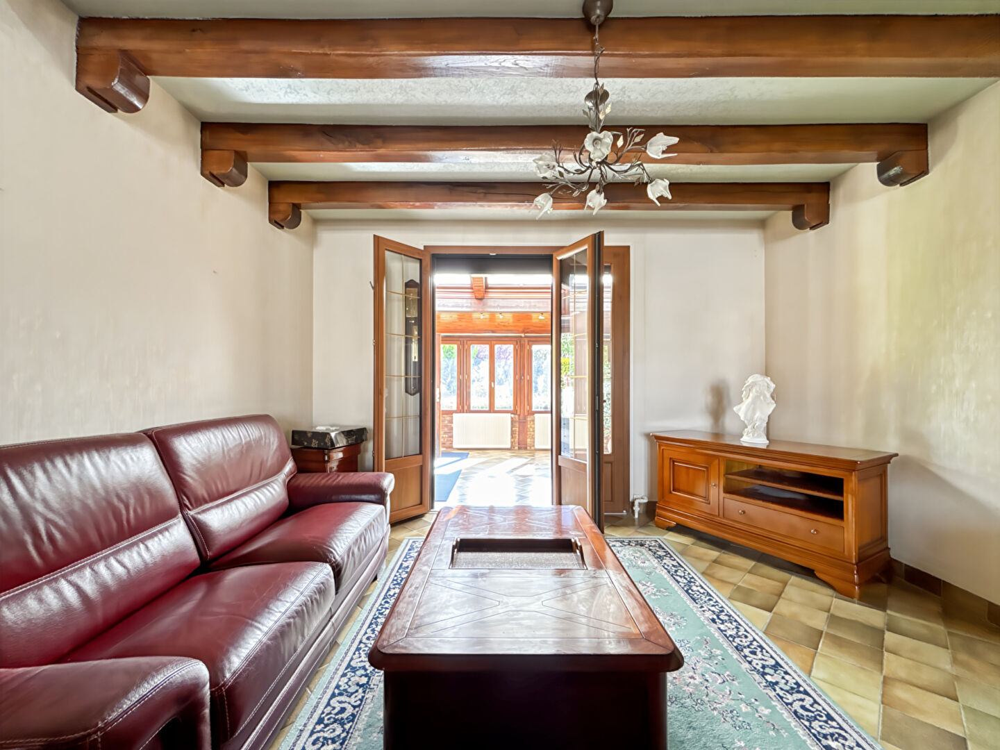
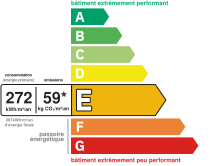
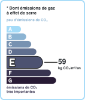

# Maison | AUREA IMMOBILIER

- **URL** : https://www.aurea-immobilier.fr/catalog/products_print.php?products_id=60185157
- **Recupere le** : 2026-09-18T09:04:06
- **Description** : Maison AUREA IMMOBILIER...
- **Mots** : 538 | **Images** : 14 | **Liens internes** : 0

---

## Structure des titres

- H1 : Maison 5 pièces, 3 chambres à Mantes-la-Jolie
    - H3 : Général
    - H3 : Aspects financiers
    - H3 : Surfaces
    - H3 : Intérieur
    - H3 : Diagnostics
    - H3 : Localisation
    - H3 : Copropriété
    - H3 : Extérieur
    - H3 : Autres

## Contenu

Imprimer la fiche
Maison 5 pièces, 3 chambres à Mantes-la-Jolie
249 000 €
Référence: 789
Vincent MAUME
Tél. : : +33 6 83 70 66 01
vincent.maume@aurea-immobilier.fr
78200 Mantes-la-Jolie
Montant estimé des dépenses annuelles d'énergie pour un usage standard entre 2630€ et 3570€. indexées aux années 2021,2022 et 2023 (abonnement compris).
Vincent Maume et Zachary Denat vous présentent en exclusivité chez AUREA IMMOBILIER;
A deux pas du centre ville de Mantes la Jolie et proches de l'ensemble des commodités (transports, commerces, écoles...)
Venez découvrir cette belle maison composée de:
AU REZ DE CHAUSSEE
Entrée avec placards, séjour double/ salle à manger, cuisine aménagée et équipée, WC, une chambre.
AU PREMIER ETAGE
Deux chambres de plus de 15m2 avec une salle d'eau, une salle de bain et un WC.
EN ANNEXES :
Un sous-sol total avec espace garage et chaufferie/buanderie.
Côté extérieur :
Un très beau jardin de plus de 800m2 avec cabane pour ranger l'ensemble de vos outils.
La proximité des commodités du centre ville avec la tranquillité d'une petite rue calme, n'attendez plus et venez la découvrir.
Honoraires à la charge du vendeur
Général
A vendre
Aspects financiers
Prix
249000 EUR
Bien soumis à l'encadrement des loyers
Non
Taxe Foncière
1600 EUR
Surfaces
Surface
110 m2
Surface séjour
32 m2
Surface terrain
880 m2
Intérieur
Nombre pièces
Chambres
Salle(s) de bains
Salle(s) d'eau
WC
Cuisine
Aménagée/équipée
Plain-pied
Non
Séjour Double
Oui
Type Chauffage
Individuel
Méca. Chauffage
Radiateur
Mode Chauffage
Gaz de ville
Etat intérieur
A rafraîchir
Cheminée
Foyer ouvert
Calme
Oui
Clair
Oui
Diagnostics
Concerné par un Etat des Risques et Pollutions (ERP)
Oui
Date d'établissement Etat des Risques et Pollutions(ERP)
17/09/2025
Soumis à l'affichage du DPE
Oui
Date établissement Diagnostic Energétique
17/09/2025
Consommation énergie primaire
E
Valeur consommation énergie finale
267 kWh/m2 par an
Valeur consommation énergie primaire
272.3 kWh/m2 par an
Gaz Effet de Serre
E
Valeur Gaz Effet de serre
59 Kg CO2/m2/an
Montant minimum estimé des dépenses annuelles d'énergie pour un usage standard
2630 EUR
Montant maximum estimé des dépenses annuelles d'énergie pour un usage standard
3570 EUR
Surface de référence
108.7
Code postal
Ville
MANTES LA JOLIE
Mitoyenneté
Indépendant
Accès Bus
2 min
Copropriété
Bien en copropriété
Non
Extérieur
Jardin
Oui
Année construction
1950
Forme Toiture
Toit pente
Neuf - Ancien
Ancien
Standing
Moyen
Etat général
Travaux à prévoir
Vis à Vis
Non
Etat extérieur
Bon
Fenêtres
PVC Double Vitrage
Volets
Mixte manuels - électriques
Assainissement
Tout à l'égout
Autres
Ascenseur
Non
Cave(s)
Grenier
Non
Type de Stationnement
Garage Fermé
Nombre garages/Box
Commentaires internet
ADSL (Fibre possible)
Interphone
Non
Digicode
Non
Portail électrique
Oui
Imprimer la fiche
Affichage des informations légales : AUREA IMMOBILIER | Raison sociale : AUREA IMMOBILIER | Adresse siège social : 44 rue Nationale - 78200 Mantes-la-Jolie | Siret : 93163592400018 | RCS : Pontoise | Numero TVA Intracommunautaire : FR30931635924 | Forme juridique : SAS | Capital social : 1 000 | Assurance RCP : NC | Nom du médiateur : NC | Adresse du médiateur : NC | Adresse du site : NC |

<!-- menus et pied de page communs au site retires ; texte brut complet dans le .json -->

## Listes

**Liste 1**
- Type de bien Maison
- Type de transaction A vendre

**Liste 2**
- Prix 249000 EUR
- Bien soumis à l'encadrement des loyers Non
- Taxe Foncière 1600 EUR

**Liste 3**
- Surface 110 m2
- Surface séjour 32 m2
- Surface terrain 880 m2

**Liste 4**
- Nombre pièces 5
- Chambres 3
- Salle(s) de bains 1
- Salle(s) d'eau 1
- WC 2
- Cuisine Aménagée/équipée
- Plain-pied Non
- Séjour Double Oui
- Type Chauffage Individuel
- Méca. Chauffage Radiateur
- Mode Chauffage Gaz de ville
- Etat intérieur A rafraîchir
- Cheminée Foyer ouvert
- Calme Oui
- Clair Oui

**Liste 5**
- Concerné par un Etat des Risques et Pollutions (ERP) Oui
- Date d'établissement Etat des Risques et Pollutions(ERP) 17/09/2025
- Soumis à l'affichage du DPE Oui
- Date établissement Diagnostic Energétique 17/09/2025
- Consommation énergie primaire E
- Valeur consommation énergie finale 267 kWh/m2 par an
- Valeur consommation énergie primaire 272.3 kWh/m2 par an
- Gaz Effet de Serre E
- Valeur Gaz Effet de serre 59 Kg CO2/m2/an
- Montant minimum estimé des dépenses annuelles d'énergie pour un usage standard 2630 EUR
- Montant maximum estimé des dépenses annuelles d'énergie pour un usage standard 3570 EUR
- Surface de référence 108.7

**Liste 6**
- Code postal 78200
- Ville MANTES LA JOLIE
- Mitoyenneté Indépendant
- Accès Bus 2 min

**Liste 7**
- Jardin Oui
- Année construction 1950
- Forme Toiture Toit pente
- Neuf - Ancien Ancien
- Standing Moyen
- Etat général Travaux à prévoir
- Vis à Vis Non
- Etat extérieur Bon
- Fenêtres PVC Double Vitrage
- Volets Mixte manuels - électriques
- Assainissement Tout à l'égout

**Liste 8**
- Ascenseur Non
- Cave(s) 1
- Grenier Non
- Type de Stationnement Garage Fermé
- Nombre garages/Box 1
- Commentaires internet ADSL (Fibre possible)
- Interphone Non
- Digicode Non
- Portail électrique Oui

## Images

-  — *AUREA IMMOBILIER* — `https://www.aurea-immobilier.fr/segments/immo/catalog/images/manufacturers_logo/385554.jpg`
-  — *sans alt* — `https://www.aurea-immobilier.fr/office5/aureaimmo_140824/catalog/images/pr_p/6/0/1/8/5/1/5/7/60185157a.jpg`
-  — *sans alt* — `https://www.aurea-immobilier.fr/office5/aureaimmo_140824/catalog/images/pr_p/6/0/1/8/5/1/5/7/60185157b.jpg`
-  — *sans alt* — `https://www.aurea-immobilier.fr/office5/aureaimmo_140824/catalog/images/pr_p/6/0/1/8/5/1/5/7/60185157c.jpg`
-  — *Consommation énergetique* — `https://www.aurea-immobilier.fr/office5_front/aureaimmo_140824/cache/dpe_ges/dpe_565fba7558285c0b67d86baf62480faa.svg`
-  — *Faible émission de GES* — `https://www.aurea-immobilier.fr/office5_front/aureaimmo_140824/cache/dpe_ges/ges_565fba7558285c0b67d86baf62480faa.svg`
-  — *sans alt* — `https://www.aurea-immobilier.fr/catalog/images/puce_fleche.gif`
-  — *sans alt* — `https://www.aurea-immobilier.fr/catalog/images/puce_fleche.gif`
-  — *sans alt* — `https://www.aurea-immobilier.fr/catalog/images/puce_fleche.gif`
-  — *sans alt* — `https://www.aurea-immobilier.fr/catalog/images/puce_fleche.gif`
-  — *sans alt* — `https://www.aurea-immobilier.fr/catalog/images/puce_fleche.gif`
-  — *sans alt* — `https://www.aurea-immobilier.fr/catalog/images/puce_fleche.gif`
-  — *sans alt* — `https://www.aurea-immobilier.fr/catalog/images/puce_fleche.gif`
-  — *sans alt* — `https://www.aurea-immobilier.fr/catalog/images/puce_fleche.gif`

## Contacts detectes

- Email : vincent.maume@aurea-immobilier.fr
- Telephone : +33 6 83 70 66 01
- Telephone : 01.14.12.31.29
- Telephone : 01.39.33.71.72
- Telephone : 09.05.22.09.28
- Telephone : 0931635924
