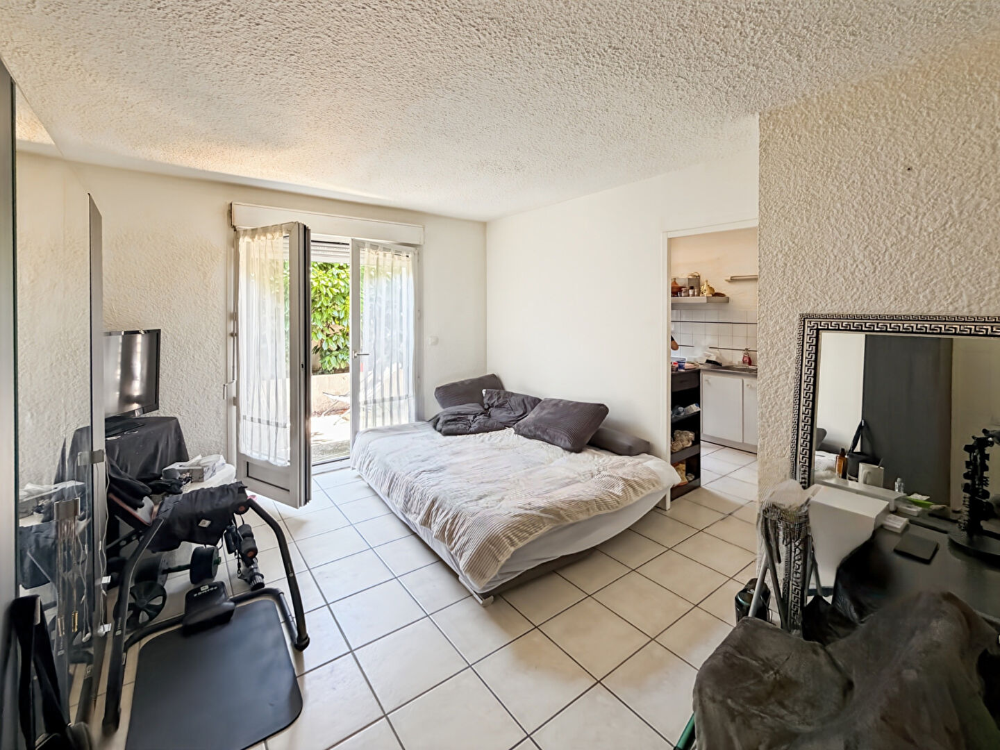
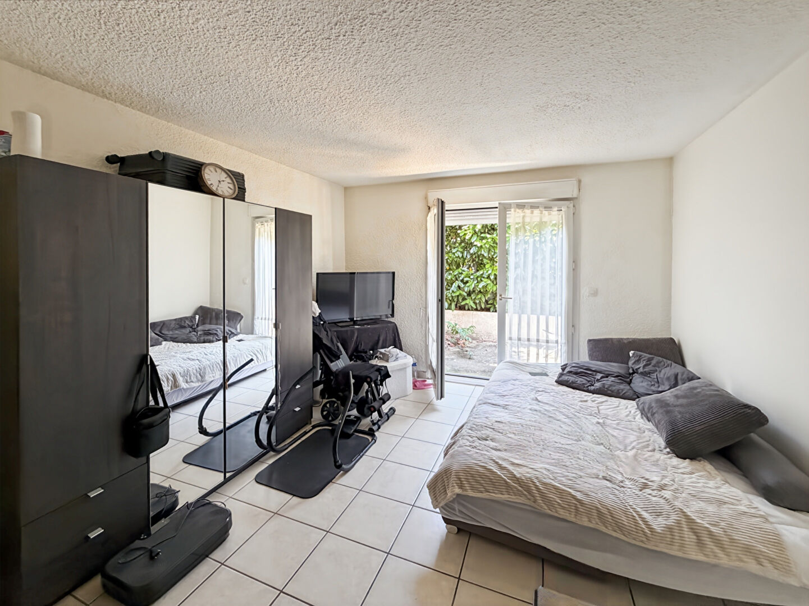
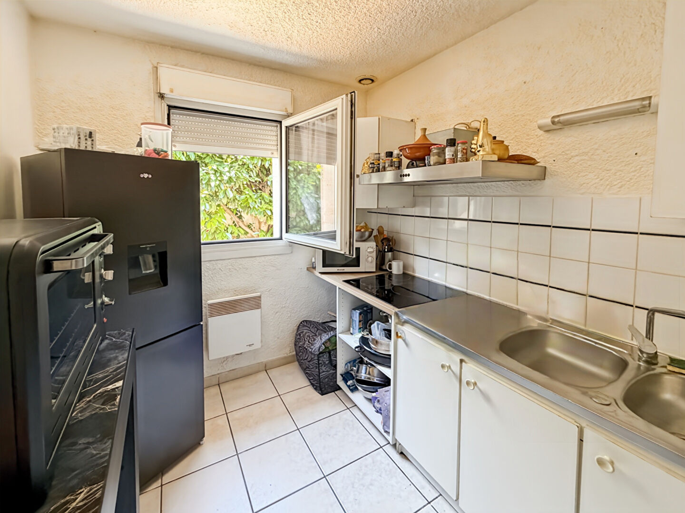
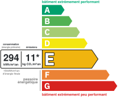
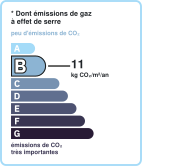

# Studio T1 | AUREA IMMOBILIER

- **URL** : https://www.aurea-immobilier.fr/catalog/products_print.php?products_id=60992633
- **Recupere le** : 2026-09-18T09:04:19
- **Description** : Studio T1 AUREA IMMOBILIER...
- **Mots** : 531 | **Images** : 14 | **Liens internes** : 0

---

## Structure des titres

- H1 : Joli studio à Mantes-la-Jolie de 28 m2
    - H3 : Général
    - H3 : Aspects financiers
    - H3 : Surfaces
    - H3 : Intérieur
    - H3 : Diagnostics
    - H3 : Localisation
    - H3 : Copropriété
    - H3 : Extérieur
    - H3 : Autres

## Contenu

Imprimer la fiche
Joli studio à Mantes-la-Jolie de 28 m2
90 000 €
Référence: 938
Vincent MAUME
Tél. : : +33 6 83 70 66 01
vincent.maume@aurea-immobilier.fr
78200 Mantes-la-Jolie
Montant estimé des dépenses annuelles d'énergie pour un usage standard entre 660€ et 900€. Pour la date de référence 01/01/2021.
Vincent Maume, vous présente en exclusivité chez AUREA IMMOBILIER :
Situé à Mantes-la-Jolie, venez découvrir ce beau studio à proximité de la gare de Mantes-Station et à proximité de l'ensemble des commerces et écoles.
Il se compose de la manière suivante : entrée donnant sur la pièce de vie, cuisine, WC et salle de bain.
En extérieur, une terrasse privative ainsi qu'une place de parking complète l'ensemble.
Actuellement loué 570euros (charges comprises),.
Idéal pour investissement locatif.
N'hésitez pas à prendre contact avec moi rapidement pour plus d'informations !
Honoraires à la charge du vendeur
Général
Appartement
A vendre
Aspects financiers
Prix
90000 EUR
Bien soumis à l'encadrement des loyers
Non
Surfaces
Surface
28.61 m2
Intérieur
Nombre pièces
Chambres
Chambre RDC
Salle(s) de bains
WC
Cuisine
Aménagée
Séjour Double
Non
Type Chauffage
Individuel
Méca. Chauffage
Radiateur
Mode Chauffage
Electrique
Etat intérieur
A rafraîchir
Calme
Oui
Clair
Oui
Diagnostics
Concerné par un Etat des Risques et Pollutions (ERP)
Oui
Date d'établissement Etat des Risques et Pollutions(ERP)
26/12/2022
Soumis à l'affichage du DPE
Oui
Date établissement Diagnostic Energétique
26/12/2022
Consommation énergie primaire
E
Consommation énergie finale
E
Valeur consommation énergie primaire
294.3 kWh/m2 par an
Valeur consommation énergie finale
154 kWh/m2 par an
Gaz Effet de Serre
B
Valeur Gaz Effet de serre
11 Kg CO2/m2/an
Année de référence des prix de l'énergie (DPE réalisés jusqu'au 30/06/2024)
01/01/2021
Montant minimum estimé des dépenses annuelles d'énergie pour un usage standard
660 EUR
Montant maximum estimé des dépenses annuelles d'énergie pour un usage standard
900 EUR
Code postal
Ville
MANTES LA JOLIE
Rez de chaussée
Oui
Dernier Etage
Non
Accès Bus
1 min
Accès Métro
5 min
Copropriété
Bien en copropriété
Oui
Nb Lots Copropriété
17
Charges annuelles (ALUR)
700 EUR
Procédures diligentées c/ syndicat de copropriété
Pas de procédure en cours
Extérieur
Jardin
Oui
Année construction
1983
Forme Toiture
Toit pente
Neuf - Ancien
Ancien
Standing
Moyen
Etat général
A Rafraîchir
Vis à Vis
Non
Etat extérieur
A rafraîchir
Fenêtres
PVC Double Vitrage
Volets
PVC Roulant
Assainissement
Tout à l'égout
Autres
Type parking
Simple
Ascenseur
Non
Grenier
Non
Type de Stationnement
Extérieur
Nombre places parking
Commentaires internet
Fibre
Interphone
Oui
Digicode
Oui
Portail électrique
Oui
Imprimer la fiche
Ce bien fait partie d'une copropriété de 17 lots.Les charges annuelles sont de 700€.
Affichage des informations légales : AUREA IMMOBILIER | Raison sociale : AUREA IMMOBILIER | Adresse siège social : 44 rue Nationale - 78200 Mantes-la-Jolie | Siret : 93163592400018 | RCS : Pontoise | Numero TVA Intracommunautaire : FR30931635924 | Forme juridique : SAS | Capital social : 1 000 | Assurance RCP : NC | Nom du médiateur : NC | Adresse du médiateur : NC | Adresse du site : NC |

<!-- menus et pied de page communs au site retires ; texte brut complet dans le .json -->

## Listes

**Liste 1**
- Type de bien Appartement
- Type de transaction A vendre

**Liste 2**
- Prix 90000 EUR
- Bien soumis à l'encadrement des loyers Non

**Liste 3**
- Nombre pièces 1
- Chambres 1
- Chambre RDC 1
- Salle(s) de bains 1
- WC 1
- Cuisine Aménagée
- Séjour Double Non
- Type Chauffage Individuel
- Méca. Chauffage Radiateur
- Mode Chauffage Electrique
- Etat intérieur A rafraîchir
- Calme Oui
- Clair Oui

**Liste 4**
- Concerné par un Etat des Risques et Pollutions (ERP) Oui
- Date d'établissement Etat des Risques et Pollutions(ERP) 26/12/2022
- Soumis à l'affichage du DPE Oui
- Date établissement Diagnostic Energétique 26/12/2022
- Consommation énergie primaire E
- Consommation énergie finale E
- Valeur consommation énergie primaire 294.3 kWh/m2 par an
- Valeur consommation énergie finale 154 kWh/m2 par an
- Gaz Effet de Serre B
- Valeur Gaz Effet de serre 11 Kg CO2/m2/an
- Année de référence des prix de l'énergie (DPE réalisés jusqu'au 30/06/2024) 01/01/2021
- Montant minimum estimé des dépenses annuelles d'énergie pour un usage standard 660 EUR
- Montant maximum estimé des dépenses annuelles d'énergie pour un usage standard 900 EUR

**Liste 5**
- Code postal 78200
- Ville MANTES LA JOLIE
- Rez de chaussée Oui
- Dernier Etage Non
- Accès Bus 1 min
- Accès Métro 5 min

**Liste 6**
- Bien en copropriété Oui
- Nb Lots Copropriété 17
- Charges annuelles (ALUR) 700 EUR
- Procédures diligentées c/ syndicat de copropriété Pas de procédure en cours

**Liste 7**
- Jardin Oui
- Année construction 1983
- Forme Toiture Toit pente
- Neuf - Ancien Ancien
- Standing Moyen
- Etat général A Rafraîchir
- Vis à Vis Non
- Etat extérieur A rafraîchir
- Fenêtres PVC Double Vitrage
- Volets PVC Roulant
- Assainissement Tout à l'égout

**Liste 8**
- Type parking Simple
- Ascenseur Non
- Grenier Non
- Type de Stationnement Extérieur
- Nombre places parking 1
- Commentaires internet Fibre
- Interphone Oui
- Digicode Oui
- Portail électrique Oui

## Images

-  — *AUREA IMMOBILIER* — `https://www.aurea-immobilier.fr/segments/immo/catalog/images/manufacturers_logo/385554.jpg`
-  — *sans alt* — `https://www.aurea-immobilier.fr/office5/aureaimmo_140824/catalog/images/pr_p/6/0/9/9/2/6/3/3/60992633a.jpg`
-  — *sans alt* — `https://www.aurea-immobilier.fr/office5/aureaimmo_140824/catalog/images/pr_p/6/0/9/9/2/6/3/3/60992633b.jpg`
-  — *sans alt* — `https://www.aurea-immobilier.fr/office5/aureaimmo_140824/catalog/images/pr_p/6/0/9/9/2/6/3/3/60992633c.jpg`
-  — *Consommation énergetique* — `https://www.aurea-immobilier.fr/office5_front/aureaimmo_140824/cache/dpe_ges/dpe_dc50b4f99f7cf3a6e53e19e64c95db0c.svg`
-  — *Faible émission de GES* — `https://www.aurea-immobilier.fr/office5_front/aureaimmo_140824/cache/dpe_ges/ges_dc50b4f99f7cf3a6e53e19e64c95db0c.svg`
-  — *sans alt* — `https://www.aurea-immobilier.fr/catalog/images/puce_fleche.gif`
-  — *sans alt* — `https://www.aurea-immobilier.fr/catalog/images/puce_fleche.gif`
-  — *sans alt* — `https://www.aurea-immobilier.fr/catalog/images/puce_fleche.gif`
-  — *sans alt* — `https://www.aurea-immobilier.fr/catalog/images/puce_fleche.gif`
-  — *sans alt* — `https://www.aurea-immobilier.fr/catalog/images/puce_fleche.gif`
-  — *sans alt* — `https://www.aurea-immobilier.fr/catalog/images/puce_fleche.gif`
-  — *sans alt* — `https://www.aurea-immobilier.fr/catalog/images/puce_fleche.gif`
-  — *sans alt* — `https://www.aurea-immobilier.fr/catalog/images/puce_fleche.gif`

## Contacts detectes

- Email : vincent.maume@aurea-immobilier.fr
- Telephone : +33 6 83 70 66 01
- Telephone : 01.14.12.31.29
- Telephone : 01.39.33.71.72
- Telephone : 09.05.22.09.28
- Telephone : 0931635924
