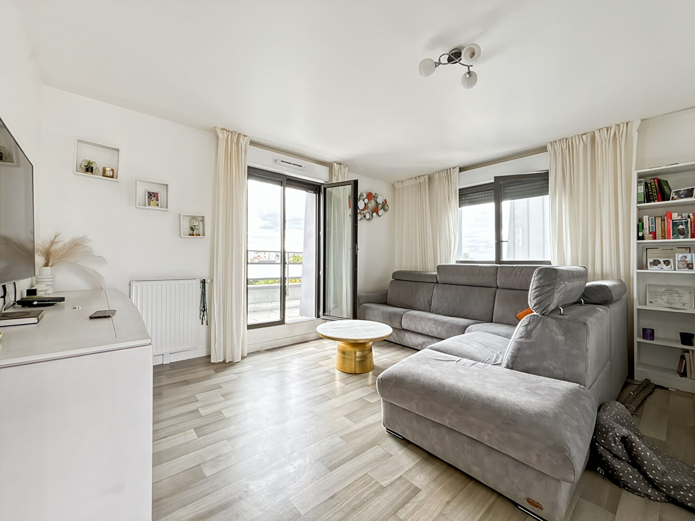
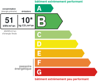
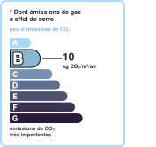

# 4 pièces | AUREA IMMOBILIER

- **URL** : https://www.aurea-immobilier.fr/catalog/products_print.php?products_id=61483159
- **Recupere le** : 2026-09-18T09:03:26
- **Description** : 4 pièces AUREA IMMOBILIER...
- **Mots** : 657 | **Images** : 13 | **Liens internes** : 0

---

## Structure des titres

- H1 : Appartement lumineux de 4 pièces à Mantes-la-Jolie
    - H3 : Général
    - H3 : Aspects financiers
    - H3 : Extérieur
    - H3 : Autres
    - H3 : Localisation
    - H3 : Surfaces
    - H3 : Intérieur
    - H3 : Diagnostics

## Contenu

Imprimer la fiche
Appartement lumineux de 4 pièces à Mantes-la-Jolie
Loyer 1 400 €/mois
charges comprises
Référence: 1002
Vincent MAUME
Tél. : : +33 6 83 70 66 01
vincent.maume@aurea-immobilier.fr
78200 Mantes-la-Jolie
Montant estimé des dépenses annuelles d'énergie pour un usage standard entre 400€ et 560€. Pour la date de référence 01/01/2021.
Vincent Maume, vous présente en exclusivité chez AUREA IMMOBILIER :
Situé à Mantes-la-Jolie, venez découvrir ce magnifique appartement de 4 pièces très lumineux qui sera vous séduire.
A proximité de toutes commodités et des transports, cet appartement est composé de;
- une entrée donnant sur couloir desservant 3 belles chambres, un WC, une salle de douche ainsi qu'une salle de bain.
- Un salon avec cuisine aménagée et équipée donnant sur une terrasse (côté cuisine) et un balcon (côté salon)
Une place de parking en sous-sol complète l'ensemble
Disponible à partir du 15 Octobre - Une visite s'impose, contactez-moi rapidement !
Loyer de base : 1115 euros par mois
Provision pour charges : 285 euros, soumise à régularisation annuelle (inclus chauffage, eau, entretien des communs, place de parking et ascenseur)
Honoraires charge locataire: 883 euros
dont:
Visite, constitution dossier, rédaction de bail: 640 euros
Etablissement état des lieux: 243 euros
Dépôt de garantie: 1115 euros
Afin de visiter ce bien, le dépôt d'un dossier complet est obligatoire, prenez contact avec moi par email afin que nous puissions faire le nécessaire ensemble !
Loyer 1 400 €/mois
charges comprises
dont charges récupérables: 285 €/mois
|
Honoraires charge locataire: 883 € TTC
dont honoraires d'état des lieux: 243 € TTC
|
Dépôt de garantie: 1 115 €
|
78200 MANTES LA JOLIE
|
Surface habitable: 80m²
Général
Appartement
A louer
Aspects financiers
Bien soumis à l'encadrement des loyers
Non
Loyer mensuel HC
1115 EUR
Loyer de base
1115 EUR
Provision sur charges
285 EUR
Loyer charges comprises
1400 EUR
Honoraires Locataire
883 EUR
Dépôt de Garantie
1115 EUR
Extérieur
Jardin
Non
Année construction
2021
Forme Toiture
Toit pente
Neuf - Ancien
Récent
Standing
Normal
Etat général
Bon Etat
Vis à Vis
Non
Etat extérieur
Bon
Fenêtres
PVC Double Vitrage
Volets
PVC Roulant
Isolation
Par le toit et les murs
Assainissement
Tout à l'égout
Autres
Ascenseur
Oui
Grenier
Non
Type de Stationnement
Sous-Sol
Nombre places parking
Commentaires internet
Fibre
Interphone
Oui
Digicode
Oui
Portail électrique
Oui
Code postal
Ville
MANTES LA JOLIE
Etage
Nombre étages
Rez de chaussée
Non
Dernier Etage
Oui
Accès Bus
1 min
Accès Métro
5 min
Surfaces
Surface
80 m2
Intérieur
Nombre pièces
Chambres
Salle(s) de bains
Salle(s) d'eau
WC
Cuisine
Aménagée/équipée
Séjour Double
Non
Type Chauffage
Collectif
Méca. Chauffage
Radiateur
Mode Chauffage
Gaz
Etat intérieur
Bon
Calme
Oui
Clair
Oui
Diagnostics
Concerné par un Etat des Risques et Pollutions (ERP)
Oui
Date d'établissement Etat des Risques et Pollutions(ERP)
03/01/2022
Soumis à l'affichage du DPE
Oui
Date établissement Diagnostic Energétique
03/01/2022
Consommation énergie finale
B
Consommation énergie primaire
B
Valeur consommation énergie finale
48.1 kWh/m2 par an
Valeur consommation énergie primaire
51.4 kWh/m2 par an
Gaz Effet de Serre
B
Valeur Gaz Effet de serre
10.3 Kg CO2/m2/an
Montant minimum estimé des dépenses annuelles d'énergie pour un usage standard
400 EUR
Année de référence des prix de l'énergie (DPE réalisés jusqu'au 30/06/2024)
01/01/2021
Montant maximum estimé des dépenses annuelles d'énergie pour un usage standard
560 EUR
Imprimer la fiche
Affichage des informations légales : AUREA IMMOBILIER | Raison sociale : AUREA IMMOBILIER | Adresse siège social : 44 rue Nationale - 78200 Mantes-la-Jolie | Siret : 93163592400018 | RCS : Pontoise | Numero TVA Intracommunautaire : FR30931635924 | Forme juridique : SAS | Capital social : 1 000 | Assurance RCP : NC | Nom du médiateur : NC | Adresse du médiateur : NC | Adresse du site : NC |

<!-- menus et pied de page communs au site retires ; texte brut complet dans le .json -->

## Listes

**Liste 1**
- Type de bien Appartement
- Type de transaction A louer

**Liste 2**
- Bien soumis à l'encadrement des loyers Non
- Loyer mensuel HC 1115 EUR
- Loyer de base 1115 EUR
- Provision sur charges 285 EUR
- Loyer charges comprises 1400 EUR
- Honoraires Locataire 883 EUR
- Dépôt de Garantie 1115 EUR

**Liste 3**
- Jardin Non
- Année construction 2021
- Forme Toiture Toit pente
- Neuf - Ancien Récent
- Standing Normal
- Etat général Bon Etat
- Vis à Vis Non
- Etat extérieur Bon
- Fenêtres PVC Double Vitrage
- Volets PVC Roulant
- Isolation Par le toit et les murs
- Assainissement Tout à l'égout

**Liste 4**
- Ascenseur Oui
- Grenier Non
- Type de Stationnement Sous-Sol
- Nombre places parking 1
- Commentaires internet Fibre
- Interphone Oui
- Digicode Oui
- Portail électrique Oui

**Liste 5**
- Code postal 78200
- Ville MANTES LA JOLIE
- Etage 4
- Nombre étages 4
- Rez de chaussée Non
- Dernier Etage Oui
- Accès Bus 1 min
- Accès Métro 5 min

**Liste 6**
- Nombre pièces 4
- Chambres 3
- Salle(s) de bains 1
- Salle(s) d'eau 1
- WC 1
- Cuisine Aménagée/équipée
- Séjour Double Non
- Type Chauffage Collectif
- Méca. Chauffage Radiateur
- Mode Chauffage Gaz
- Etat intérieur Bon
- Calme Oui
- Clair Oui

**Liste 7**
- Concerné par un Etat des Risques et Pollutions (ERP) Oui
- Date d'établissement Etat des Risques et Pollutions(ERP) 03/01/2022
- Soumis à l'affichage du DPE Oui
- Date établissement Diagnostic Energétique 03/01/2022
- Consommation énergie finale B
- Consommation énergie primaire B
- Valeur consommation énergie finale 48.1 kWh/m2 par an
- Valeur consommation énergie primaire 51.4 kWh/m2 par an
- Gaz Effet de Serre B
- Valeur Gaz Effet de serre 10.3 Kg CO2/m2/an
- Montant minimum estimé des dépenses annuelles d'énergie pour un usage standard 400 EUR
- Année de référence des prix de l'énergie (DPE réalisés jusqu'au 30/06/2024) 01/01/2021
- Montant maximum estimé des dépenses annuelles d'énergie pour un usage standard 560 EUR

## Images

-  — *AUREA IMMOBILIER* — `https://www.aurea-immobilier.fr/segments/immo/catalog/images/manufacturers_logo/385554.jpg`
-  — *sans alt* — `https://www.aurea-immobilier.fr/office5/aureaimmo_140824/catalog/images/pr_p/6/1/4/8/3/1/5/9/61483159a.jpg`
-  — *sans alt* — `https://www.aurea-immobilier.fr/office5/aureaimmo_140824/catalog/images/pr_p/6/1/4/8/3/1/5/9/61483159b.jpg`
-  — *sans alt* — `https://www.aurea-immobilier.fr/office5/aureaimmo_140824/catalog/images/pr_p/6/1/4/8/3/1/5/9/61483159c.jpg`
-  — *Consommation énergetique* — `https://www.aurea-immobilier.fr/office5_front/aureaimmo_140824/cache/dpe_ges/dpe_3b17196323273853169ba21fba4b7711.svg`
-  — *Faible émission de GES* — `https://www.aurea-immobilier.fr/office5_front/aureaimmo_140824/cache/dpe_ges/ges_3b17196323273853169ba21fba4b7711.svg`
-  — *sans alt* — `https://www.aurea-immobilier.fr/catalog/images/puce_fleche.gif`
-  — *sans alt* — `https://www.aurea-immobilier.fr/catalog/images/puce_fleche.gif`
-  — *sans alt* — `https://www.aurea-immobilier.fr/catalog/images/puce_fleche.gif`
-  — *sans alt* — `https://www.aurea-immobilier.fr/catalog/images/puce_fleche.gif`
-  — *sans alt* — `https://www.aurea-immobilier.fr/catalog/images/puce_fleche.gif`
-  — *sans alt* — `https://www.aurea-immobilier.fr/catalog/images/puce_fleche.gif`
-  — *sans alt* — `https://www.aurea-immobilier.fr/catalog/images/puce_fleche.gif`

## Contacts detectes

- Email : vincent.maume@aurea-immobilier.fr
- Telephone : +33 6 83 70 66 01
- Telephone : 01.14.12.31.29
- Telephone : 01.39.33.71.72
- Telephone : 09.05.22.09.28
- Telephone : 0931635924
