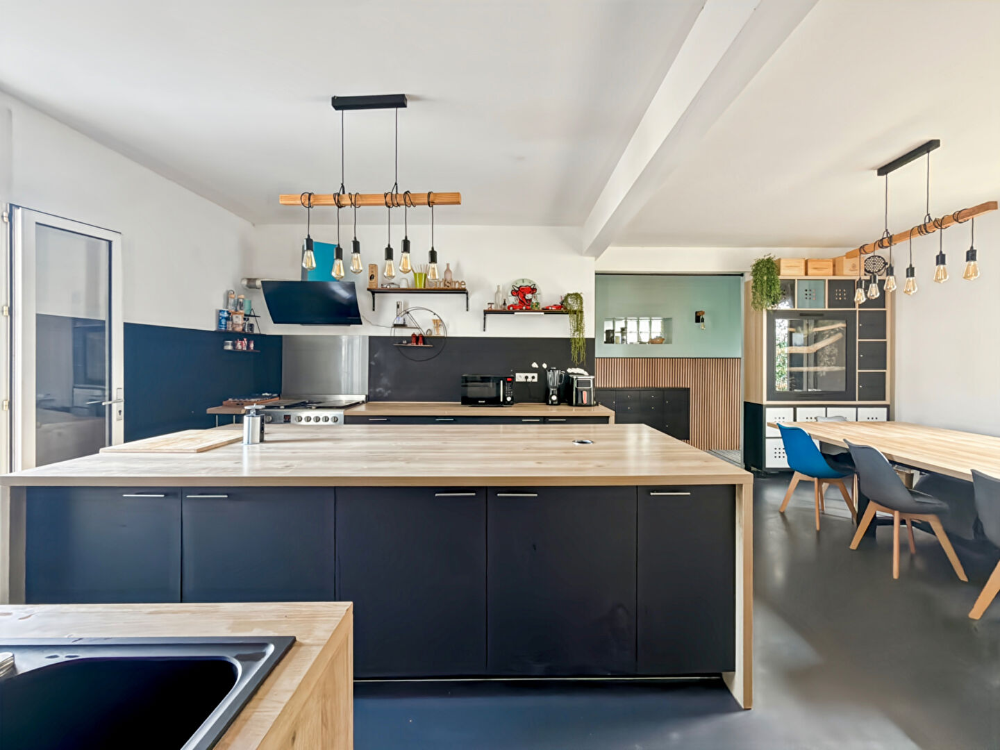
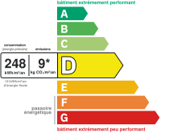
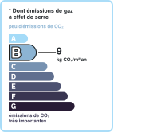

# Maison | AUREA IMMOBILIER

- **URL** : https://www.aurea-immobilier.fr/catalog/products_print.php?products_id=61452626
- **Recupere le** : 2026-09-18T09:03:50
- **Description** : Maison AUREA IMMOBILIER...
- **Mots** : 566 | **Images** : 14 | **Liens internes** : 0

---

## Structure des titres

- H1 : MAISON FAMILIALE - 8 PIÈCES - MANTES LA VILLE
    - H3 : Général
    - H3 : Aspects financiers
    - H3 : Surfaces
    - H3 : Intérieur
    - H3 : Diagnostics
    - H3 : Localisation
    - H3 : Copropriété
    - H3 : Extérieur
    - H3 : Autres

## Contenu

Imprimer la fiche
MAISON FAMILIALE - 8 PIÈCES - MANTES LA VILLE
370 000 €
Référence: 983
Oriane Cherel
Tél. : : +33 6 99 39 88 48
oriane.cherel@aurea-immobilier.fr
78200 Mantes-la-Jolie
Montant estimé des dépenses annuelles d'énergie pour un usage standard entre 3620€ et 4920€. indexées aux années 2021,2022 et 2023 (abonnement compris).
Oriane CHEREL, AUREA Immobilier, vous présente :
Idéalement située à Mantes-la-Ville, venez découvrir cette spacieuse maison familiale de 188 m² habitables, comprenant :
Au rez-de-chaussée : une entrée dessert un séjour lumineux, une salle à manger ainsi qu'une cuisine ouverte. Ce niveau comprend également une première chambre, une salle d'eau avec WC, des WC indépendants ainsi qu'une grande salle de jeux.
Au premier étage : un couloir dessert 5 chambres, une salle de bains ainsi que des WC indépendants.
Au sous-sol : une buanderie ainsi qu'un dressing viennent compléter les espaces de rangement de la maison.
Côté extérieur : vous profiterez d'un agréable jardin piscinable, d'une terrasse de plus de 27 m² ainsi que de deux garages indépendants.
LES PLUS :
- Beaux volumes
- Jardin piscinable
- Gare de Mantes-Station 5 min à pied (Future desserte du RER E)
- Centre-ville de Mantes-la-Jolie à 10 min à pied
- Toutes les commodités à moins de 5 min à pied
Une maison familiale aux volumes généreux, bénéficiant d'un emplacement privilégié permettant de profiter de toutes les commodités du quotidien à pied. Un bien idéal pour une grande famille à la recherche d'espace, d'un extérieur agréable et d'une excellente accessibilité.
N'attendez plus et venez découvrir votre futur lieu de vie !
Honoraires à la charge du vendeur
Général
A vendre
Aspects financiers
Prix
370000 EUR
Bien soumis à l'encadrement des loyers
Non
Taxe Foncière
2094 EUR
Surfaces
Surface
188 m2
Surface terrain
749 m2
Intérieur
Nombre pièces
8
Chambres
6
Chambre RDC
Salle(s) de bains
WC
Cuisine
Aménagée/équipée
Nombre niveaux
Séjour Double
Oui
Type Chauffage
Individuel
Méca. Chauffage
Radiateur
Mode Chauffage
Pompe à chaleur air/eau
Calme
Oui
Clair
Oui
Diagnostics
Concerné par un Etat des Risques et Pollutions (ERP)
Non
Soumis à l'affichage du DPE
Oui
Date établissement Diagnostic Energétique
22/01/2026
Consommation énergie finale
D
Consommation énergie primaire
D
Valeur consommation énergie finale
131 kWh/m2 par an
Valeur consommation énergie primaire
248 kWh/m2 par an
Gaz Effet de Serre
B
Valeur Gaz Effet de serre
9 Kg CO2/m2/an
Montant minimum estimé des dépenses annuelles d'énergie pour un usage standard
3620 EUR
Montant maximum estimé des dépenses annuelles d'énergie pour un usage standard
4920 EUR
Surface de référence
160
Code postal
78711
Ville
MANTES LA VILLE
Mitoyenneté
Indépendant
Accès Bus
5 min
Accès RER
5 min
Copropriété
Bien en copropriété
Non
Extérieur
Jardin
Oui
Année construction
1900
Forme Toiture
Toit pente
Neuf - Ancien
Ancien
Standing
Bon
Autres
Nombre garages/Box
Imprimer la fiche
Affichage des informations légales : AUREA IMMOBILIER | Raison sociale : AUREA IMMOBILIER | Adresse siège social : 44 rue Nationale - 78200 Mantes-la-Jolie | Siret : 93163592400018 | RCS : Pontoise | Numero TVA Intracommunautaire : FR30931635924 | Forme juridique : SAS | Capital social : 1 000 | Assurance RCP : NC | Nom du médiateur : NC | Adresse du médiateur : NC | Adresse du site : NC |

<!-- menus et pied de page communs au site retires ; texte brut complet dans le .json -->

## Listes

**Liste 1**
- Type de bien Maison
- Type de transaction A vendre

**Liste 2**
- Prix 370000 EUR
- Bien soumis à l'encadrement des loyers Non
- Taxe Foncière 2094 EUR

**Liste 3**
- Surface 188 m2
- Surface terrain 749 m2

**Liste 4**
- Nombre pièces 8
- Chambres 6
- Chambre RDC 1
- Salle(s) de bains 2
- WC 3
- Cuisine Aménagée/équipée
- Nombre niveaux 3
- Séjour Double Oui
- Type Chauffage Individuel
- Méca. Chauffage Radiateur
- Mode Chauffage Pompe à chaleur air/eau
- Calme Oui
- Clair Oui

**Liste 5**
- Concerné par un Etat des Risques et Pollutions (ERP) Non
- Soumis à l'affichage du DPE Oui
- Date établissement Diagnostic Energétique 22/01/2026
- Consommation énergie finale D
- Consommation énergie primaire D
- Valeur consommation énergie finale 131 kWh/m2 par an
- Valeur consommation énergie primaire 248 kWh/m2 par an
- Gaz Effet de Serre B
- Valeur Gaz Effet de serre 9 Kg CO2/m2/an
- Montant minimum estimé des dépenses annuelles d'énergie pour un usage standard 3620 EUR
- Montant maximum estimé des dépenses annuelles d'énergie pour un usage standard 4920 EUR
- Surface de référence 160

**Liste 6**
- Code postal 78711
- Ville MANTES LA VILLE
- Mitoyenneté Indépendant
- Accès Bus 5 min
- Accès RER 5 min

**Liste 7**
- Jardin Oui
- Année construction 1900
- Forme Toiture Toit pente
- Neuf - Ancien Ancien
- Standing Bon

## Images

-  — *AUREA IMMOBILIER* — `https://www.aurea-immobilier.fr/segments/immo/catalog/images/manufacturers_logo/385554.jpg`
-  — *sans alt* — `https://www.aurea-immobilier.fr/office5/aureaimmo_140824/catalog/images/pr_p/6/1/4/5/2/6/2/6/61452626a.jpg`
-  — *sans alt* — `https://www.aurea-immobilier.fr/office5/aureaimmo_140824/catalog/images/pr_p/6/1/4/5/2/6/2/6/61452626b.jpg`
-  — *sans alt* — `https://www.aurea-immobilier.fr/office5/aureaimmo_140824/catalog/images/pr_p/6/1/4/5/2/6/2/6/61452626c.jpg`
-  — *Consommation énergetique* — `https://www.aurea-immobilier.fr/office5_front/aureaimmo_140824/cache/dpe_ges/dpe_108ee0ef93697540bf66d51e50b2346b.svg`
-  — *Faible émission de GES* — `https://www.aurea-immobilier.fr/office5_front/aureaimmo_140824/cache/dpe_ges/ges_108ee0ef93697540bf66d51e50b2346b.svg`
-  — *sans alt* — `https://www.aurea-immobilier.fr/catalog/images/puce_fleche.gif`
-  — *sans alt* — `https://www.aurea-immobilier.fr/catalog/images/puce_fleche.gif`
-  — *sans alt* — `https://www.aurea-immobilier.fr/catalog/images/puce_fleche.gif`
-  — *sans alt* — `https://www.aurea-immobilier.fr/catalog/images/puce_fleche.gif`
-  — *sans alt* — `https://www.aurea-immobilier.fr/catalog/images/puce_fleche.gif`
-  — *sans alt* — `https://www.aurea-immobilier.fr/catalog/images/puce_fleche.gif`
-  — *sans alt* — `https://www.aurea-immobilier.fr/catalog/images/puce_fleche.gif`
-  — *sans alt* — `https://www.aurea-immobilier.fr/catalog/images/puce_fleche.gif`

## Contacts detectes

- Email : oriane.cherel@aurea-immobilier.fr
- Telephone : +33 6 99 39 88 48
- Telephone : 01.14.12.31.29
- Telephone : 01.39.33.71.72
- Telephone : 09.05.22.09.28
- Telephone : 0931635924
