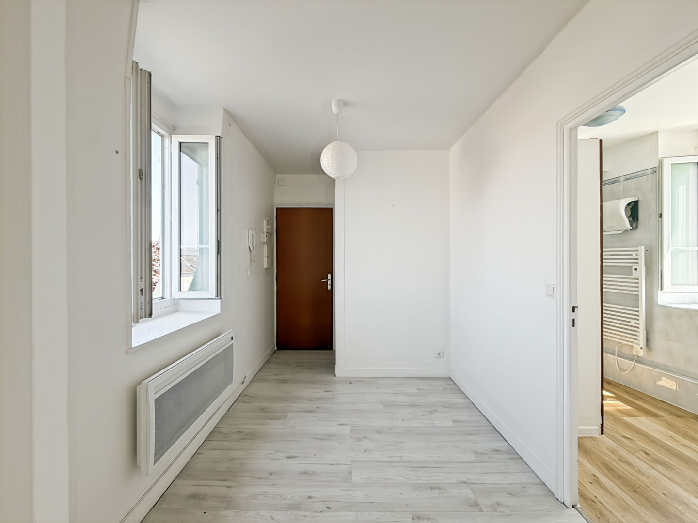
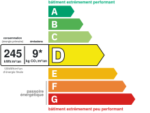

# 3 pièces | AUREA IMMOBILIER

- **URL** : https://www.aurea-immobilier.fr/catalog/products_print.php?products_id=60962717
- **Recupere le** : 2026-09-18T09:04:41
- **Description** : 3 pièces AUREA IMMOBILIER...
- **Mots** : 508 | **Images** : 14 | **Liens internes** : 0

---

## Structure des titres

- H1 : APPARTEMENT - MANTES LA JOLIE - GARE
    - H3 : Général
    - H3 : Aspects financiers
    - H3 : Surfaces
    - H3 : Intérieur
    - H3 : Diagnostics
    - H3 : Localisation
    - H3 : Copropriété
    - H3 : Extérieur
    - H3 : Autres

## Contenu

Imprimer la fiche
APPARTEMENT - MANTES LA JOLIE - GARE
142 000 €
Référence: 932
Oriane Cherel
Tél. : : +33 6 99 39 88 48
oriane.cherel@aurea-immobilier.fr
78200 Mantes-la-Jolie
Montant estimé des dépenses annuelles d'énergie pour un usage standard entre 1150€ et 1590€. indexées aux années 2021,2022 et 2023 (abonnement compris).
Oriane CHEREL, AUREA Immobilier, vous présente en exclusivité :
Idéalement situé à deux pas de la gare de Mantes-la-Jolie, découvrez cet appartement de type T3, au dernier étage, comprenant :
Une entrée, un séjour, une cuisine ouverte, deux chambres, une salle d'eau et un WC indépendant.
Une grande cave complète ce bien.
LES PLUS :
- Emplacement recherché
- Gare et commerces accessibles à pied
- Appartement traversant
- Fenêtres en PVC double vitrage
- Bonne isolation
- Faibles charges de copropriété
Idéal pour un primo-accédant ou un investissement locatif.
Une belle opportunité à ne pas manquer ! Contactez-moi rapidement pour organiser une visite.
Honoraires à la charge du vendeur
Général
Appartement
A vendre
Aspects financiers
Prix
142000 EUR
Bien soumis à l'encadrement des loyers
Non
Taxe Foncière
774 EUR
Surfaces
Surface
50 m2
Intérieur
Nombre pièces
Chambres
Salle(s) d'eau
WC
Cuisine
Aménagée/équipée
Nombre niveaux
Exposition Séjour
SUD - NORD
Séjour Double
Non
Type Chauffage
Individuel
Méca. Chauffage
Radiateur
Mode Chauffage
Electrique
Diagnostics
Concerné par un Etat des Risques et Pollutions (ERP)
Oui
Date d'établissement Etat des Risques et Pollutions(ERP)
21/07/2026
Soumis à l'affichage du DPE
Oui
Date établissement Diagnostic Energétique
21/07/2026
Consommation énergie primaire
D
Consommation énergie finale
C
Valeur consommation énergie primaire
245 kWh/m2 par an
Valeur consommation énergie finale
129 kWh/m2 par an
Gaz Effet de Serre
B
Valeur Gaz Effet de serre
9 Kg CO2/m2/an
Montant minimum estimé des dépenses annuelles d'énergie pour un usage standard
1150 EUR
Montant maximum estimé des dépenses annuelles d'énergie pour un usage standard
1590 EUR
Surface de référence
49.04
Code postal
Ville
MANTES LA JOLIE
Etage
Nombre étages
Rez de chaussée
Non
Dernier Etage
Oui
Accès RER
2 min
Copropriété
Bien en copropriété
Oui
Nb Lots Copropriété
8
Dont lots d'habitation
Charges annuelles (ALUR)
136 EUR
Quote part de charges
228
Extérieur
Jardin
Non
Année construction
1900
Forme Toiture
Toit pente
Neuf - Ancien
Ancien
Fenêtres
PVC Double Vitrage
Assainissement
Tout à l'égout
Autres
Ascenseur
Non
Cave(s)
Grenier
Non
Interphone
Oui
Digicode
Oui
Imprimer la fiche
Ce bien fait partie d'une copropriété de 8 lots.Les charges annuelles sont de 136€.
Affichage des informations légales : AUREA IMMOBILIER | Raison sociale : AUREA IMMOBILIER | Adresse siège social : 44 rue Nationale - 78200 Mantes-la-Jolie | Siret : 93163592400018 | RCS : Pontoise | Numero TVA Intracommunautaire : FR30931635924 | Forme juridique : SAS | Capital social : 1 000 | Assurance RCP : NC | Nom du médiateur : NC | Adresse du médiateur : NC | Adresse du site : NC |

<!-- menus et pied de page communs au site retires ; texte brut complet dans le .json -->

## Listes

**Liste 1**
- Type de bien Appartement
- Type de transaction A vendre

**Liste 2**
- Prix 142000 EUR
- Bien soumis à l'encadrement des loyers Non
- Taxe Foncière 774 EUR

**Liste 3**
- Nombre pièces 3
- Chambres 2
- Salle(s) d'eau 1
- WC 1
- Cuisine Aménagée/équipée
- Nombre niveaux 1
- Exposition Séjour SUD - NORD
- Séjour Double Non
- Type Chauffage Individuel
- Méca. Chauffage Radiateur
- Mode Chauffage Electrique

**Liste 4**
- Concerné par un Etat des Risques et Pollutions (ERP) Oui
- Date d'établissement Etat des Risques et Pollutions(ERP) 21/07/2026
- Soumis à l'affichage du DPE Oui
- Date établissement Diagnostic Energétique 21/07/2026
- Consommation énergie primaire D
- Consommation énergie finale C
- Valeur consommation énergie primaire 245 kWh/m2 par an
- Valeur consommation énergie finale 129 kWh/m2 par an
- Gaz Effet de Serre B
- Valeur Gaz Effet de serre 9 Kg CO2/m2/an
- Montant minimum estimé des dépenses annuelles d'énergie pour un usage standard 1150 EUR
- Montant maximum estimé des dépenses annuelles d'énergie pour un usage standard 1590 EUR
- Surface de référence 49.04

**Liste 5**
- Code postal 78200
- Ville MANTES LA JOLIE
- Etage 3
- Nombre étages 3
- Rez de chaussée Non
- Dernier Etage Oui
- Accès RER 2 min

**Liste 6**
- Bien en copropriété Oui
- Nb Lots Copropriété 8
- Dont lots d'habitation 4
- Charges annuelles (ALUR) 136 EUR
- Quote part de charges 228

**Liste 7**
- Jardin Non
- Année construction 1900
- Forme Toiture Toit pente
- Neuf - Ancien Ancien
- Fenêtres PVC Double Vitrage
- Assainissement Tout à l'égout

**Liste 8**
- Ascenseur Non
- Cave(s) 1
- Grenier Non
- Interphone Oui
- Digicode Oui

## Images

-  — *AUREA IMMOBILIER* — `https://www.aurea-immobilier.fr/segments/immo/catalog/images/manufacturers_logo/385554.jpg`
-  — *sans alt* — `https://www.aurea-immobilier.fr/office5/aureaimmo_140824/catalog/images/pr_p/6/0/9/6/2/7/1/7/60962717a.jpg`
-  — *sans alt* — `https://www.aurea-immobilier.fr/office5/aureaimmo_140824/catalog/images/pr_p/6/0/9/6/2/7/1/7/60962717b.jpg`
-  — *sans alt* — `https://www.aurea-immobilier.fr/office5/aureaimmo_140824/catalog/images/pr_p/6/0/9/6/2/7/1/7/60962717c.jpg`
-  — *Consommation énergetique* — `https://www.aurea-immobilier.fr/office5_front/aureaimmo_140824/cache/dpe_ges/dpe_a6bd419bf963e8e9f0c8e31441c67ea8.svg`
-  — *Faible émission de GES* — `https://www.aurea-immobilier.fr/office5_front/aureaimmo_140824/cache/dpe_ges/ges_a6bd419bf963e8e9f0c8e31441c67ea8.svg`
-  — *sans alt* — `https://www.aurea-immobilier.fr/catalog/images/puce_fleche.gif`
-  — *sans alt* — `https://www.aurea-immobilier.fr/catalog/images/puce_fleche.gif`
-  — *sans alt* — `https://www.aurea-immobilier.fr/catalog/images/puce_fleche.gif`
-  — *sans alt* — `https://www.aurea-immobilier.fr/catalog/images/puce_fleche.gif`
-  — *sans alt* — `https://www.aurea-immobilier.fr/catalog/images/puce_fleche.gif`
-  — *sans alt* — `https://www.aurea-immobilier.fr/catalog/images/puce_fleche.gif`
-  — *sans alt* — `https://www.aurea-immobilier.fr/catalog/images/puce_fleche.gif`
-  — *sans alt* — `https://www.aurea-immobilier.fr/catalog/images/puce_fleche.gif`

## Contacts detectes

- Email : oriane.cherel@aurea-immobilier.fr
- Telephone : +33 6 99 39 88 48
- Telephone : 01.14.12.31.29
- Telephone : 01.39.33.71.72
- Telephone : 09.05.22.09.28
- Telephone : 0931635924
