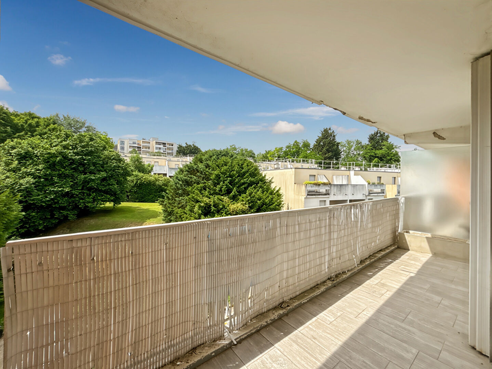
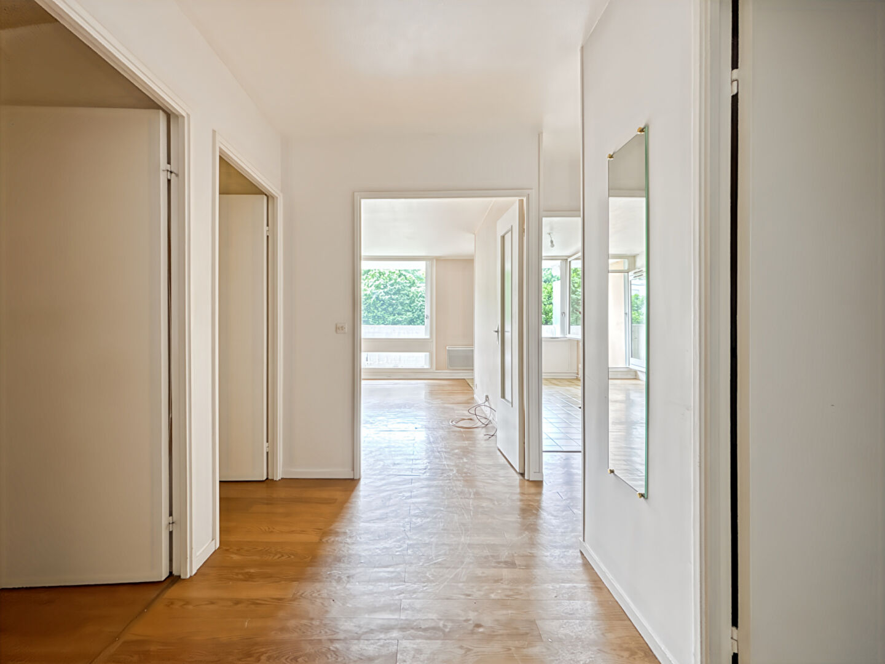
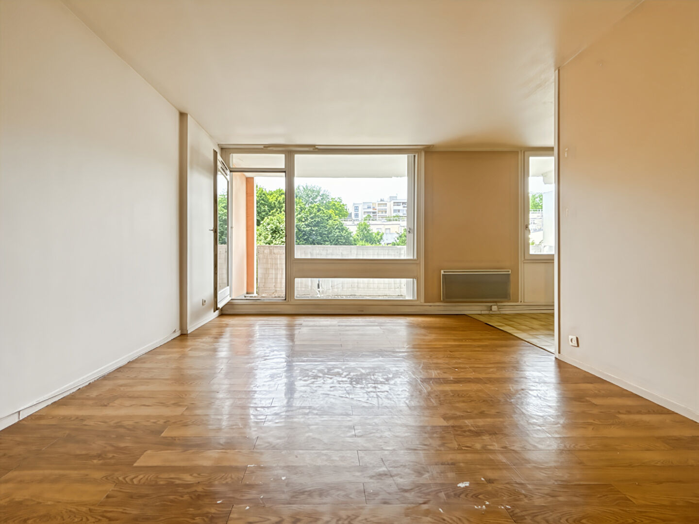
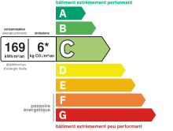
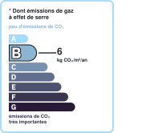

# 3 pièces | AUREA IMMOBILIER

- **URL** : https://www.aurea-immobilier.fr/catalog/products_print.php?products_id=60609523
- **Recupere le** : 2026-09-18T09:03:41
- **Description** : 3 pièces AUREA IMMOBILIER...
- **Mots** : 531 | **Images** : 14 | **Liens internes** : 0

---

## Structure des titres

- H1 : APPARTEMENT - 3 PIÈCES - ANDRÉSY
    - H3 : Général
    - H3 : Aspects financiers
    - H3 : Surfaces
    - H3 : Intérieur
    - H3 : Diagnostics
    - H3 : Localisation
    - H3 : Copropriété
    - H3 : Extérieur
    - H3 : Autres

## Contenu

Imprimer la fiche
APPARTEMENT - 3 PIÈCES - ANDRÉSY
200 000 €
Référence: 871
Oriane Cherel
Tél. : : +33 6 99 39 88 48
oriane.cherel@aurea-immobilier.fr
78200 Mantes-la-Jolie
Montant estimé des dépenses annuelles d'énergie pour un usage standard entre 1190€ et 1660€. indexées aux années 2021,2022 et 2023 (abonnement compris).
Oriane CHEREL, AUREA Immobilier, vous présente :
Idéalement situé à Andrésy, dans une résidence calme, proche de toutes les commodités et des transports, venez découvrir cet appartement de type F3 comprenant :
Entrée avec dressing, salon lumineux donnant accès à un balcon, cuisine, couloir avec rangements desservant deux chambres, un dressing, une salle de bains et des WC indépendants.
En annexe : une place de parking en sous-sol ainsi qu'une cave.
LES PLUS :
- Commerces et transports à moins de 10 minutes à pied
- Calme et lumineux
- Bonne performance énergétique
- Beaux espaces
- Stationnement facile au sein de la résidence
Appartement lumineux à proximité de toutes les commodités. N'attendez plus et venez le visiter !
Honoraires à la charge du vendeur
Général
Appartement
A vendre
Aspects financiers
Prix
200000 EUR
Bien soumis à l'encadrement des loyers
Non
Taxe Foncière
1932 EUR
Surfaces
Surface
73.4 m2
Intérieur
Nombre pièces
Chambres
Salle(s) de bains
WC
Cuisine
Semi-ouverte Aménagée
Nombre niveaux
Exposition Séjour
OUEST
Séjour Double
Non
Type Chauffage
Mixte
Méca. Chauffage
Radiateur
Mode Chauffage
Electrique
Calme
Oui
Clair
Oui
Diagnostics
Concerné par un Etat des Risques et Pollutions (ERP)
Non
Soumis à l'affichage du DPE
Oui
Date établissement Diagnostic Energétique
21/01/2026
Consommation énergie primaire
C
Consommation énergie finale
B
Valeur consommation énergie primaire
169 kWh/m2 par an
Valeur consommation énergie finale
89 kWh/m2 par an
Gaz Effet de Serre
B
Valeur Gaz Effet de serre
6 Kg CO2/m2/an
Montant minimum estimé des dépenses annuelles d'énergie pour un usage standard
1190 EUR
Montant maximum estimé des dépenses annuelles d'énergie pour un usage standard
1660 EUR
Surface de référence
73.4
Code postal
78570
Ville
ANDRESY
Etage
Nombre étages
6
Rez de chaussée
Non
Dernier Etage
Non
Accès RER
8 min
Copropriété
Bien en copropriété
Oui
Nb Lots Copropriété
100
Charges annuelles (ALUR)
2686.57 EUR
Procédures diligentées c/ syndicat de copropriété
Pas de procédure en cours
Extérieur
Année construction
1980
Neuf - Ancien
Ancien
Standing
Moyen
Etat général
Bon Etat
Vis à Vis
Non
Etat extérieur
Bon
Fenêtres
Bois double vitrage
Volets
Bois
Assainissement
Tout à l'égout
Autres
Ascenseur
Oui
Cave(s)
Grenier
Non
Type de Stationnement
Sous-Sol
Nombre places parking
Imprimer la fiche
Ce bien fait partie d'une copropriété de 100 lots.Les charges annuelles sont de 2686.57€.
Affichage des informations légales : AUREA IMMOBILIER | Raison sociale : AUREA IMMOBILIER | Adresse siège social : 44 rue Nationale - 78200 Mantes-la-Jolie | Siret : 93163592400018 | RCS : Pontoise | Numero TVA Intracommunautaire : FR30931635924 | Forme juridique : SAS | Capital social : 1 000 | Assurance RCP : NC | Nom du médiateur : NC | Adresse du médiateur : NC | Adresse du site : NC |

<!-- menus et pied de page communs au site retires ; texte brut complet dans le .json -->

## Listes

**Liste 1**
- Type de bien Appartement
- Type de transaction A vendre

**Liste 2**
- Prix 200000 EUR
- Bien soumis à l'encadrement des loyers Non
- Taxe Foncière 1932 EUR

**Liste 3**
- Nombre pièces 3
- Chambres 2
- Salle(s) de bains 1
- WC 1
- Cuisine Semi-ouverte Aménagée
- Nombre niveaux 1
- Exposition Séjour OUEST
- Séjour Double Non
- Type Chauffage Mixte
- Méca. Chauffage Radiateur
- Mode Chauffage Electrique
- Calme Oui
- Clair Oui

**Liste 4**
- Concerné par un Etat des Risques et Pollutions (ERP) Non
- Soumis à l'affichage du DPE Oui
- Date établissement Diagnostic Energétique 21/01/2026
- Consommation énergie primaire C
- Consommation énergie finale B
- Valeur consommation énergie primaire 169 kWh/m2 par an
- Valeur consommation énergie finale 89 kWh/m2 par an
- Gaz Effet de Serre B
- Valeur Gaz Effet de serre 6 Kg CO2/m2/an
- Montant minimum estimé des dépenses annuelles d'énergie pour un usage standard 1190 EUR
- Montant maximum estimé des dépenses annuelles d'énergie pour un usage standard 1660 EUR
- Surface de référence 73.4

**Liste 5**
- Code postal 78570
- Ville ANDRESY
- Etage 2
- Nombre étages 6
- Rez de chaussée Non
- Dernier Etage Non
- Accès RER 8 min

**Liste 6**
- Bien en copropriété Oui
- Nb Lots Copropriété 100
- Charges annuelles (ALUR) 2686.57 EUR
- Procédures diligentées c/ syndicat de copropriété Pas de procédure en cours

**Liste 7**
- Année construction 1980
- Neuf - Ancien Ancien
- Standing Moyen
- Etat général Bon Etat
- Vis à Vis Non
- Etat extérieur Bon
- Fenêtres Bois double vitrage
- Volets Bois
- Assainissement Tout à l'égout

**Liste 8**
- Ascenseur Oui
- Cave(s) 1
- Grenier Non
- Type de Stationnement Sous-Sol
- Nombre places parking 1

## Images

-  — *AUREA IMMOBILIER* — `https://www.aurea-immobilier.fr/segments/immo/catalog/images/manufacturers_logo/385554.jpg`
-  — *sans alt* — `https://www.aurea-immobilier.fr/office5/aureaimmo_140824/catalog/images/pr_p/6/0/6/0/9/5/2/3/60609523a.jpg`
-  — *sans alt* — `https://www.aurea-immobilier.fr/office5/aureaimmo_140824/catalog/images/pr_p/6/0/6/0/9/5/2/3/60609523b.jpg`
-  — *sans alt* — `https://www.aurea-immobilier.fr/office5/aureaimmo_140824/catalog/images/pr_p/6/0/6/0/9/5/2/3/60609523c.jpg`
-  — *Consommation énergetique* — `https://www.aurea-immobilier.fr/office5_front/aureaimmo_140824/cache/dpe_ges/dpe_1919c97f367b9d407ea46d72074a0f0e.svg`
-  — *Faible émission de GES* — `https://www.aurea-immobilier.fr/office5_front/aureaimmo_140824/cache/dpe_ges/ges_1919c97f367b9d407ea46d72074a0f0e.svg`
-  — *sans alt* — `https://www.aurea-immobilier.fr/catalog/images/puce_fleche.gif`
-  — *sans alt* — `https://www.aurea-immobilier.fr/catalog/images/puce_fleche.gif`
-  — *sans alt* — `https://www.aurea-immobilier.fr/catalog/images/puce_fleche.gif`
-  — *sans alt* — `https://www.aurea-immobilier.fr/catalog/images/puce_fleche.gif`
-  — *sans alt* — `https://www.aurea-immobilier.fr/catalog/images/puce_fleche.gif`
-  — *sans alt* — `https://www.aurea-immobilier.fr/catalog/images/puce_fleche.gif`
-  — *sans alt* — `https://www.aurea-immobilier.fr/catalog/images/puce_fleche.gif`
-  — *sans alt* — `https://www.aurea-immobilier.fr/catalog/images/puce_fleche.gif`

## Contacts detectes

- Email : oriane.cherel@aurea-immobilier.fr
- Telephone : +33 6 99 39 88 48
- Telephone : 01.14.12.31.29
- Telephone : 01.39.33.71.72
- Telephone : 09.05.22.09.28
- Telephone : 0931635924
