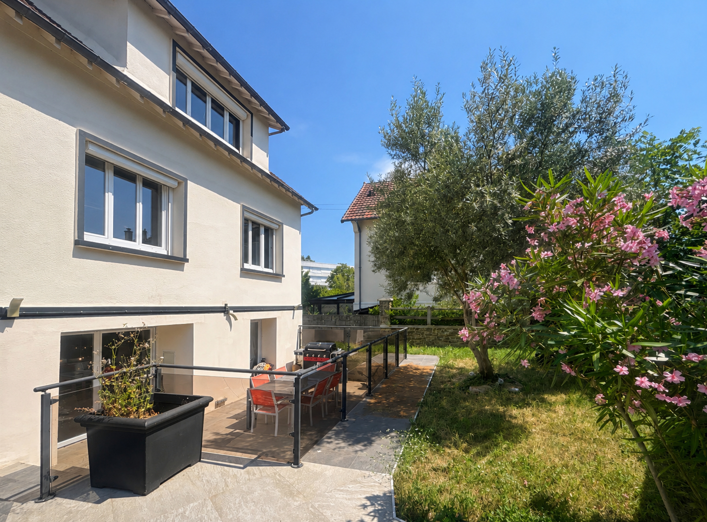
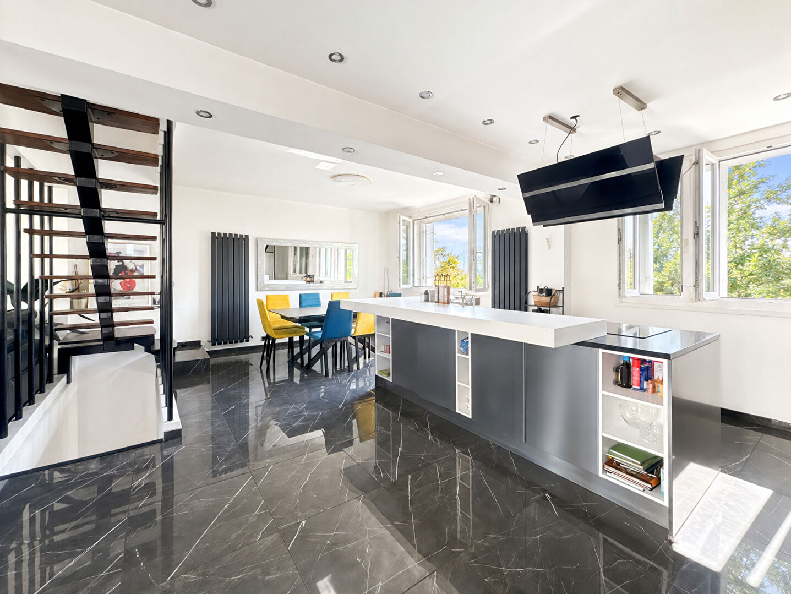
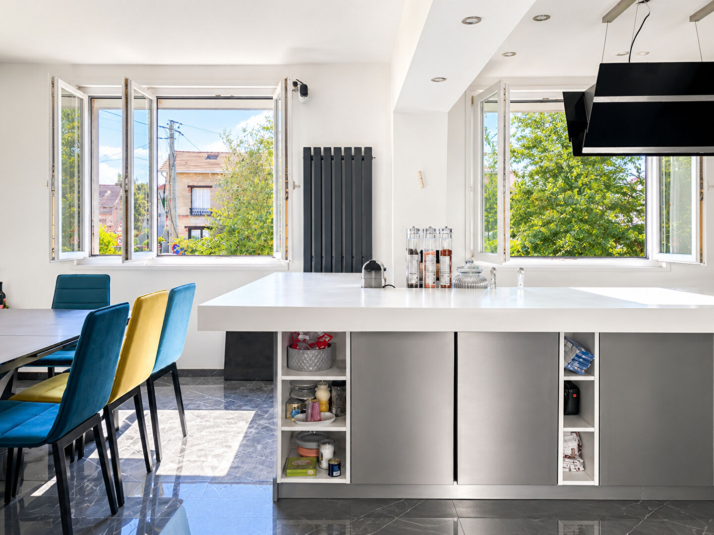
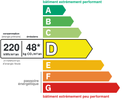
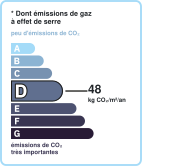

# Maison | AUREA IMMOBILIER

- **URL** : https://www.aurea-immobilier.fr/catalog/products_print.php?products_id=59514626
- **Recupere le** : 2026-09-18T09:04:35
- **Description** : Maison AUREA IMMOBILIER...
- **Mots** : 540 | **Images** : 14 | **Liens internes** : 0

---

## Structure des titres

- H1 : MAISON CHATOU - 5Pièces - RER A
    - H3 : Général
    - H3 : Aspects financiers
    - H3 : Surfaces
    - H3 : Intérieur
    - H3 : Diagnostics
    - H3 : Localisation
    - H3 : Copropriété
    - H3 : Extérieur
    - H3 : Autres

## Contenu

Imprimer la fiche
MAISON CHATOU - 5Pièces - RER A
850 000 €
Référence: 649
Hélène VERMEIRE BENZ
Tél. : : +33 6 33 63 02 55
helene.vermeire@aurea-immobilier.fr
78200 Mantes-la-Jolie
Montant estimé des dépenses annuelles d'énergie pour un usage standard entre 3010€ et 4090€. indexées aux années 2021,2022 et 2023 (abonnement compris).
Hélène VERMEIRE BENZ, AUREA Immobilier, vous présente en exclusivité.
Au coeur d'un quartier résidentiel familial de CHATOU, proche des écoles, commerces et transports, maison de 160m² édifiée sur un terrain de 426m² comprenant :
AU REZ DE CHAUSSEE SUR ELEVEE
Vaste pièce de vie avec salon, salle à manger, cuisine aménagée et équipée et WC indépendants
EN REZ DE JARDIN
Suite parentale d'environ 50m² avec espace chambre, dressing, salle d'eau avec jacuzzi
A L'ETAGE
Palier desservant 2 chambres avec dressing et salle d'eau
Côté extérieur :
Un garage, une vaste terrasse un joli jardin ensoleillé
LES PLUS :
- RER A Chatou - Croissy 30 minutes à pieds
- Aucune mitoyenneté
- Ecoles publiques et privées à proximité
- Portail électrique
- Belle luminosité
Vous recherchez un quartier familial, une maison lumineuse et sans gros travaux, ne cherchez plus et venez la visiter !
Honoraires à la charge du vendeur
Général
A vendre
Aspects financiers
Prix
850000 EUR
Bien soumis à l'encadrement des loyers
Non
Taxe Foncière
1688 EUR
Coût Energie
3500 EUR/an
Surfaces
Surface
160 m2
Surface séjour
58 m2
Surface terrain
426 m2
Intérieur
Nombre pièces
Chambres
Salle(s) de bains
Salle(s) d'eau
WC
Cuisine
Américaine Equipée
Nombre niveaux
Séjour Double
Oui
Type Chauffage
Mixte
Méca. Chauffage
Convecteurs
Mode Chauffage
Gaz
Etat intérieur
Bon
Diagnostics
Concerné par un Etat des Risques et Pollutions (ERP)
Oui
Date d'établissement Etat des Risques et Pollutions(ERP)
26/05/2025
Soumis à l'affichage du DPE
Oui
Date établissement Diagnostic Energétique
11/06/2025
Consommation énergie primaire
D
Valeur consommation énergie finale
217 kWh/m2 par an
Valeur consommation énergie primaire
220.8 kWh/m2 par an
Gaz Effet de Serre
D
Valeur Gaz Effet de serre
48 Kg CO2/m2/an
Montant minimum estimé des dépenses annuelles d'énergie pour un usage standard
3010 EUR
Montant maximum estimé des dépenses annuelles d'énergie pour un usage standard
4090 EUR
Surface de référence
156
Code postal
78400
Ville
CHATOU
Nombre étages
Accès Bus
3 min
Copropriété
Bien en copropriété
Non
Extérieur
Jardin
Oui
Année construction
1930
Forme Toiture
Toit pente
Neuf - Ancien
Récent
Standing
Bon
Etat général
Bon Etat
Etat extérieur
Bon
Fenêtres
Aluminium Double Vitrage
Volets
Roulants électriques
Assainissement
Tout à l'égout
Autres
Ascenseur
Non
Type de Stationnement
Extérieur, Garage Fermé
Nombre places parking
Nombre garages/Box
Interphone
Oui
Digicode
Non
Portail électrique
Oui
Imprimer la fiche
Affichage des informations légales : AUREA IMMOBILIER | Raison sociale : AUREA IMMOBILIER | Adresse siège social : 44 rue Nationale - 78200 Mantes-la-Jolie | Siret : 93163592400018 | RCS : Pontoise | Numero TVA Intracommunautaire : FR30931635924 | Forme juridique : SAS | Capital social : 1 000 | Assurance RCP : NC | Nom du médiateur : NC | Adresse du médiateur : NC | Adresse du site : NC |

<!-- menus et pied de page communs au site retires ; texte brut complet dans le .json -->

## Listes

**Liste 1**
- Type de bien Maison
- Type de transaction A vendre

**Liste 2**
- Prix 850000 EUR
- Bien soumis à l'encadrement des loyers Non
- Taxe Foncière 1688 EUR
- Coût Energie 3500 EUR/an

**Liste 3**
- Surface 160 m2
- Surface séjour 58 m2
- Surface terrain 426 m2

**Liste 4**
- Nombre pièces 5
- Chambres 3
- Salle(s) de bains 1
- Salle(s) d'eau 1
- WC 2
- Cuisine Américaine Equipée
- Nombre niveaux 3
- Séjour Double Oui
- Type Chauffage Mixte
- Méca. Chauffage Convecteurs
- Mode Chauffage Gaz
- Etat intérieur Bon

**Liste 5**
- Concerné par un Etat des Risques et Pollutions (ERP) Oui
- Date d'établissement Etat des Risques et Pollutions(ERP) 26/05/2025
- Soumis à l'affichage du DPE Oui
- Date établissement Diagnostic Energétique 11/06/2025
- Consommation énergie primaire D
- Valeur consommation énergie finale 217 kWh/m2 par an
- Valeur consommation énergie primaire 220.8 kWh/m2 par an
- Gaz Effet de Serre D
- Valeur Gaz Effet de serre 48 Kg CO2/m2/an
- Montant minimum estimé des dépenses annuelles d'énergie pour un usage standard 3010 EUR
- Montant maximum estimé des dépenses annuelles d'énergie pour un usage standard 4090 EUR
- Surface de référence 156

**Liste 6**
- Code postal 78400
- Ville CHATOU
- Nombre étages 1
- Accès Bus 3 min

**Liste 7**
- Jardin Oui
- Année construction 1930
- Forme Toiture Toit pente
- Neuf - Ancien Récent
- Standing Bon
- Etat général Bon Etat
- Etat extérieur Bon
- Fenêtres Aluminium Double Vitrage
- Volets Roulants électriques
- Assainissement Tout à l'égout

**Liste 8**
- Ascenseur Non
- Type de Stationnement Extérieur, Garage Fermé
- Nombre places parking 4
- Nombre garages/Box 1
- Interphone Oui
- Digicode Non
- Portail électrique Oui

## Images

-  — *AUREA IMMOBILIER* — `https://www.aurea-immobilier.fr/segments/immo/catalog/images/manufacturers_logo/385554.jpg`
-  — *sans alt* — `https://www.aurea-immobilier.fr/office5/aureaimmo_140824/catalog/images/pr_p/5/9/5/1/4/6/2/6/59514626a.jpg`
-  — *sans alt* — `https://www.aurea-immobilier.fr/office5/aureaimmo_140824/catalog/images/pr_p/5/9/5/1/4/6/2/6/59514626b.jpg`
-  — *sans alt* — `https://www.aurea-immobilier.fr/office5/aureaimmo_140824/catalog/images/pr_p/5/9/5/1/4/6/2/6/59514626c.jpg`
-  — *Consommation énergetique* — `https://www.aurea-immobilier.fr/office5_front/aureaimmo_140824/cache/dpe_ges/dpe_2f3f4b457d170739a65f614a55cb12c0.svg`
-  — *Faible émission de GES* — `https://www.aurea-immobilier.fr/office5_front/aureaimmo_140824/cache/dpe_ges/ges_2f3f4b457d170739a65f614a55cb12c0.svg`
-  — *sans alt* — `https://www.aurea-immobilier.fr/catalog/images/puce_fleche.gif`
-  — *sans alt* — `https://www.aurea-immobilier.fr/catalog/images/puce_fleche.gif`
-  — *sans alt* — `https://www.aurea-immobilier.fr/catalog/images/puce_fleche.gif`
-  — *sans alt* — `https://www.aurea-immobilier.fr/catalog/images/puce_fleche.gif`
-  — *sans alt* — `https://www.aurea-immobilier.fr/catalog/images/puce_fleche.gif`
-  — *sans alt* — `https://www.aurea-immobilier.fr/catalog/images/puce_fleche.gif`
-  — *sans alt* — `https://www.aurea-immobilier.fr/catalog/images/puce_fleche.gif`
-  — *sans alt* — `https://www.aurea-immobilier.fr/catalog/images/puce_fleche.gif`

## Contacts detectes

- Email : helene.vermeire@aurea-immobilier.fr
- Telephone : +33 6 33 63 02 55
- Telephone : 01.14.12.31.29
- Telephone : 01.39.33.71.72
- Telephone : 09.05.22.09.28
- Telephone : 0931635924
