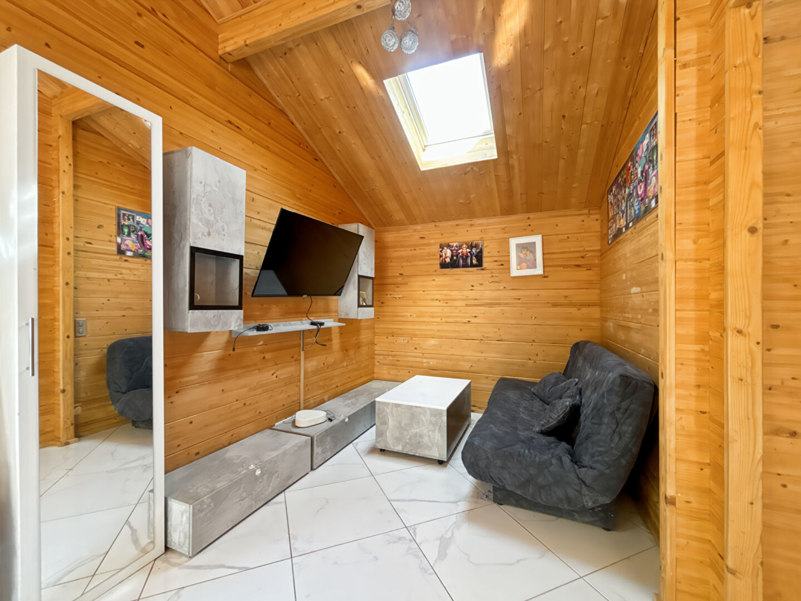
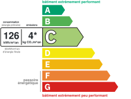
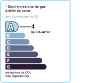

# Maison | AUREA IMMOBILIER

- **URL** : https://www.aurea-immobilier.fr/catalog/products_print.php?products_id=60114296
- **Recupere le** : 2026-09-18T09:02:55
- **Description** : Maison AUREA IMMOBILIER...
- **Mots** : 513 | **Images** : 14 | **Liens internes** : 0

---

## Structure des titres

- H1 : Maison plain-pied La Couture Boussey 4 pièces 90 m2
    - H3 : Général
    - H3 : Aspects financiers
    - H3 : Surfaces
    - H3 : Intérieur
    - H3 : Diagnostics
    - H3 : Localisation
    - H3 : Copropriété
    - H3 : Extérieur
    - H3 : Autres

## Contenu

Imprimer la fiche
Maison plain-pied La Couture Boussey 4 pièces 90 m2
199 000 €
Référence: 776
Vincent MAUME
Tél. : : +33 6 83 70 66 01
vincent.maume@aurea-immobilier.fr
78200 Mantes-la-Jolie
Montant estimé des dépenses annuelles d'énergie pour un usage standard entre 890€ et 1220€. Pour la date de référence 01/01/2021.
Vincent Maume, en exclusivité chez AUREA IMMOBILIER vous présente:
Venez découvrir cette belle maison de type chalet sur la commune de LA COUTURE BOUSSEY.
Proche de l'ensemble des commodités et des transports, ses finitions et son terrain seront vous séduire !
Composée de : entrée donnant sur salon/salle à manger avec cuisine aménagée et équipée de 40m2, un débarras, 3 chambres, WC séparé et une salle d'eau incluant baignoire et cabine de douche.
En extérieur : un terrain de plus de 1200m2 en très grande partie constructible !
Les plus :
Terrain de 1200m2
Maison aux dernières normes
3 chambres
Proche des commodités et des transports
N'attendez plus et venez visiter votre futur chez vous !
Honoraires à la charge du vendeur
Général
A vendre
Aspects financiers
Prix
199000 EUR
Bien soumis à l'encadrement des loyers
Non
Surfaces
Surface
90 m2
Surface terrain
1226 m2
Intérieur
Nombre pièces
Chambres
Chambre RDC
Salle(s) de bains
Salle(s) d'eau
WC
Cuisine
Aménagée/équipée
Plain-pied
Oui
Type Chauffage
Individuel
Méca. Chauffage
Radiateur
Mode Chauffage
Electrique
Etat intérieur
Bon
Calme
Oui
Clair
Oui
Diagnostics
Concerné par un Etat des Risques et Pollutions (ERP)
Oui
Date d'établissement Etat des Risques et Pollutions(ERP)
09/11/2021
Soumis à l'affichage du DPE
Oui
Date établissement Diagnostic Energétique
09/11/2021
Consommation énergie primaire
C
Valeur consommation énergie finale
66.5 kWh/m2 par an
Valeur consommation énergie primaire
126.2 kWh/m2 par an
Gaz Effet de Serre
A
Valeur Gaz Effet de serre
4.8 Kg CO2/m2/an
Montant minimum estimé des dépenses annuelles d'énergie pour un usage standard
890 EUR
Année de référence des prix de l'énergie (DPE réalisés jusqu'au 30/06/2024)
01/01/2021
Montant maximum estimé des dépenses annuelles d'énergie pour un usage standard
1220 EUR
Code postal
27750
Ville
LA COUTURE BOUSSEY
Mitoyenneté
Indépendant
Copropriété
Bien en copropriété
Non
Extérieur
Jardin
Oui
Année construction
2018
Forme Toiture
Toit pente
Neuf - Ancien
Récent
Standing
Normal
Etat général
Bon Etat
Vis à Vis
Non
Etat extérieur
A rafraîchir
Fenêtres
Bois double vitrage
Volets
Bois
Isolation
Par le toit et les murs
Assainissement
Tout à l'égout
Autres
Ascenseur
Non
Grenier
Non
Type de Stationnement
Extérieur
Commentaires internet
Fibre
Interphone
Oui
Digicode
Non
Portail électrique
Oui
Imprimer la fiche
Affichage des informations légales : AUREA IMMOBILIER | Raison sociale : AUREA IMMOBILIER | Adresse siège social : 44 rue Nationale - 78200 Mantes-la-Jolie | Siret : 93163592400018 | RCS : Pontoise | Numero TVA Intracommunautaire : FR30931635924 | Forme juridique : SAS | Capital social : 1 000 | Assurance RCP : NC | Nom du médiateur : NC | Adresse du médiateur : NC | Adresse du site : NC |

<!-- menus et pied de page communs au site retires ; texte brut complet dans le .json -->

## Listes

**Liste 1**
- Type de bien Maison
- Type de transaction A vendre

**Liste 2**
- Prix 199000 EUR
- Bien soumis à l'encadrement des loyers Non

**Liste 3**
- Surface 90 m2
- Surface terrain 1226 m2

**Liste 4**
- Nombre pièces 4
- Chambres 3
- Chambre RDC 3
- Salle(s) de bains 1
- Salle(s) d'eau 1
- WC 1
- Cuisine Aménagée/équipée
- Plain-pied Oui
- Type Chauffage Individuel
- Méca. Chauffage Radiateur
- Mode Chauffage Electrique
- Etat intérieur Bon
- Calme Oui
- Clair Oui

**Liste 5**
- Concerné par un Etat des Risques et Pollutions (ERP) Oui
- Date d'établissement Etat des Risques et Pollutions(ERP) 09/11/2021
- Soumis à l'affichage du DPE Oui
- Date établissement Diagnostic Energétique 09/11/2021
- Consommation énergie primaire C
- Valeur consommation énergie finale 66.5 kWh/m2 par an
- Valeur consommation énergie primaire 126.2 kWh/m2 par an
- Gaz Effet de Serre A
- Valeur Gaz Effet de serre 4.8 Kg CO2/m2/an
- Montant minimum estimé des dépenses annuelles d'énergie pour un usage standard 890 EUR
- Année de référence des prix de l'énergie (DPE réalisés jusqu'au 30/06/2024) 01/01/2021
- Montant maximum estimé des dépenses annuelles d'énergie pour un usage standard 1220 EUR

**Liste 6**
- Code postal 27750
- Ville LA COUTURE BOUSSEY
- Mitoyenneté Indépendant

**Liste 7**
- Jardin Oui
- Année construction 2018
- Forme Toiture Toit pente
- Neuf - Ancien Récent
- Standing Normal
- Etat général Bon Etat
- Vis à Vis Non
- Etat extérieur A rafraîchir
- Fenêtres Bois double vitrage
- Volets Bois
- Isolation Par le toit et les murs
- Assainissement Tout à l'égout

**Liste 8**
- Ascenseur Non
- Grenier Non
- Type de Stationnement Extérieur
- Commentaires internet Fibre
- Interphone Oui
- Digicode Non
- Portail électrique Oui

## Images

-  — *AUREA IMMOBILIER* — `https://www.aurea-immobilier.fr/segments/immo/catalog/images/manufacturers_logo/385554.jpg`
-  — *sans alt* — `https://www.aurea-immobilier.fr/office5/aureaimmo_140824/catalog/images/pr_p/6/0/1/1/4/2/9/6/60114296a.jpg`
-  — *sans alt* — `https://www.aurea-immobilier.fr/office5/aureaimmo_140824/catalog/images/pr_p/6/0/1/1/4/2/9/6/60114296b.jpg`
-  — *sans alt* — `https://www.aurea-immobilier.fr/office5/aureaimmo_140824/catalog/images/pr_p/6/0/1/1/4/2/9/6/60114296c.jpg`
-  — *Consommation énergetique* — `https://www.aurea-immobilier.fr/office5_front/aureaimmo_140824/cache/dpe_ges/dpe_dda350ba2af13a94711fb37f68fdeac0.svg`
-  — *Faible émission de GES* — `https://www.aurea-immobilier.fr/office5_front/aureaimmo_140824/cache/dpe_ges/ges_dda350ba2af13a94711fb37f68fdeac0.svg`
-  — *sans alt* — `https://www.aurea-immobilier.fr/catalog/images/puce_fleche.gif`
-  — *sans alt* — `https://www.aurea-immobilier.fr/catalog/images/puce_fleche.gif`
-  — *sans alt* — `https://www.aurea-immobilier.fr/catalog/images/puce_fleche.gif`
-  — *sans alt* — `https://www.aurea-immobilier.fr/catalog/images/puce_fleche.gif`
-  — *sans alt* — `https://www.aurea-immobilier.fr/catalog/images/puce_fleche.gif`
-  — *sans alt* — `https://www.aurea-immobilier.fr/catalog/images/puce_fleche.gif`
-  — *sans alt* — `https://www.aurea-immobilier.fr/catalog/images/puce_fleche.gif`
-  — *sans alt* — `https://www.aurea-immobilier.fr/catalog/images/puce_fleche.gif`

## Contacts detectes

- Email : vincent.maume@aurea-immobilier.fr
- Telephone : +33 6 83 70 66 01
- Telephone : 01.14.12.31.29
- Telephone : 01.39.33.71.72
- Telephone : 09.05.22.09.28
- Telephone : 0931635924
